# Basic Concepts - Part 1   　基本的な概念 - パート1

Here are some basic concepts to introduce you to the Apigee Edge API Management Platform.  
ここでは、Apigee Edge API管理プラットフォームの基本的な概念を紹介します。

**Contents**

* What is Apigee Edge?
* The Apigee Edge Management UI
* Orgs, Environments & Platform Users
* Understanding API Proxies, Policies & Flows

# What is Apigee Edge?

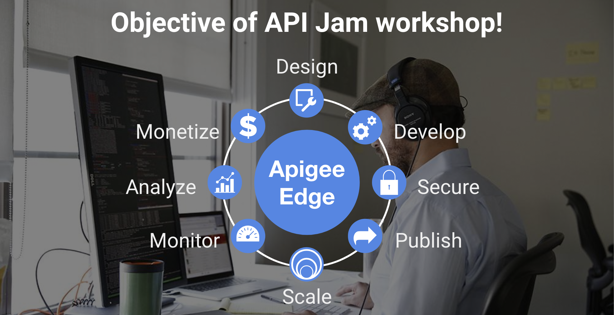

Here's a brief video to explain what Apigee does:
[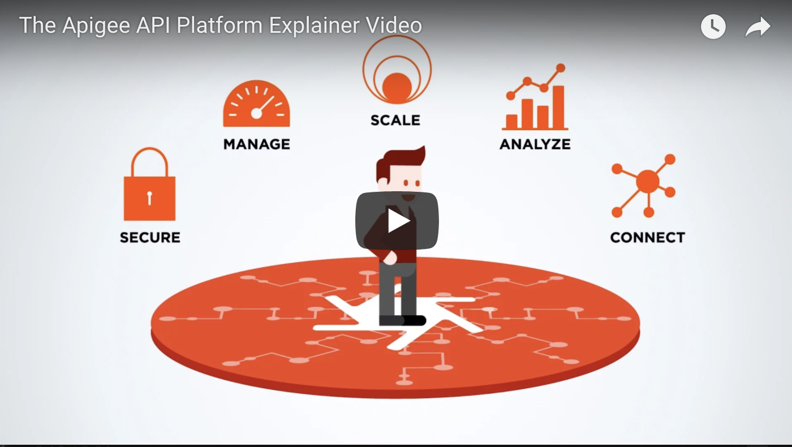](https://youtu.be/FPj_va9-rM8)

# The Apigee Edge Management UI

To log into the Apigee Edge API Management Platform, navigate to http://login.apigee.com.

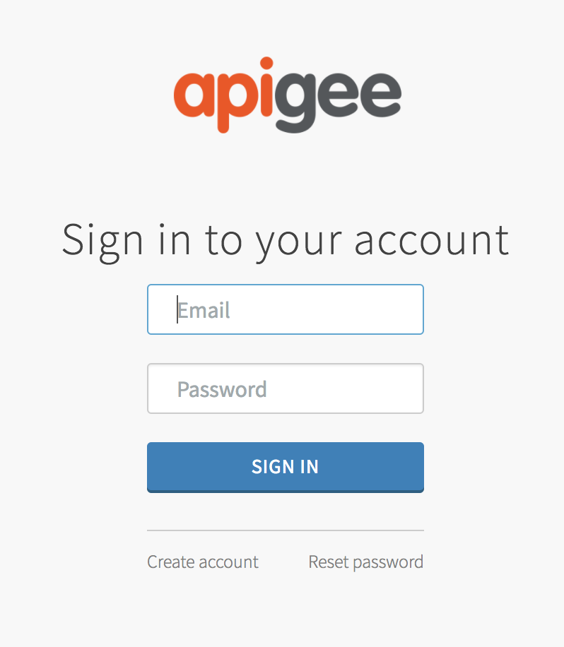

Once you have logged in, you will have access to the Management UI as shown below:

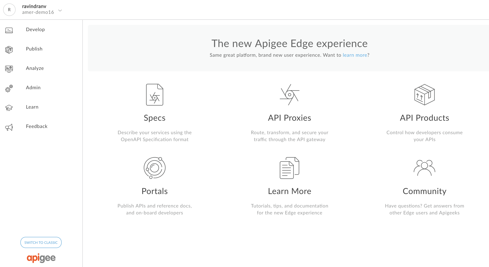

The Management UI has different sections to access the various Design & Development, Publishing, Monitoring and Administration functions within the platform.  
管理UIには、プラットフォーム内のさまざまな設計・開発、公開、監視、管理機能にアクセスするためのさまざまなセクションがあります。

### API Design & Development

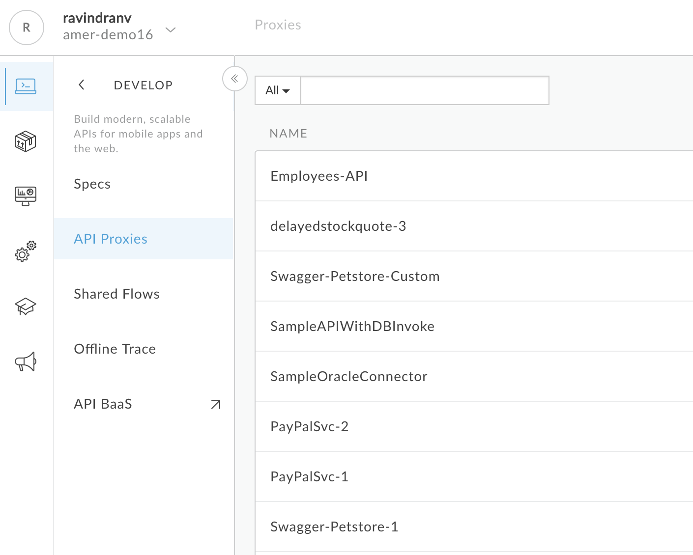

To access this section, navigate to the ‘Develop’ tab on the left corner of the Management UI. This section provides menus to perform API design and development tasks.  
このセクションにアクセスするには、管理UIの左隅にある「開発」タブに移動します。このセクションでは、API設計と開発タスクを実行するためのメニューを提供します。

### Publish APIs

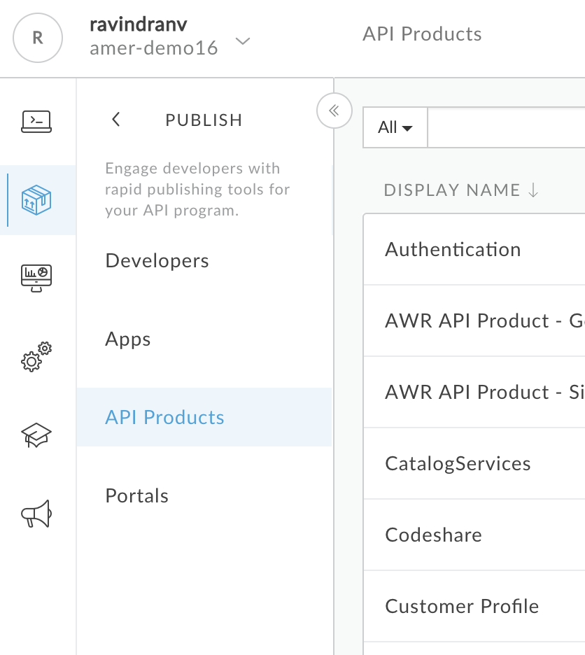

To access this section, navigate to the ‘Publish’ tab on the left corner of the Management UI. This section provides functionality used to package APIs and publish them for developer consumption, as well as manage the consumers.  
このセクションにアクセスするには、管理UIの左隅にある「Publish」タブに移動します。このセクションでは、API をパッケージ化して開発者が利用できるように公開するための機能や、コンシューマーを管理するための機能を提供します。

### Anlytics

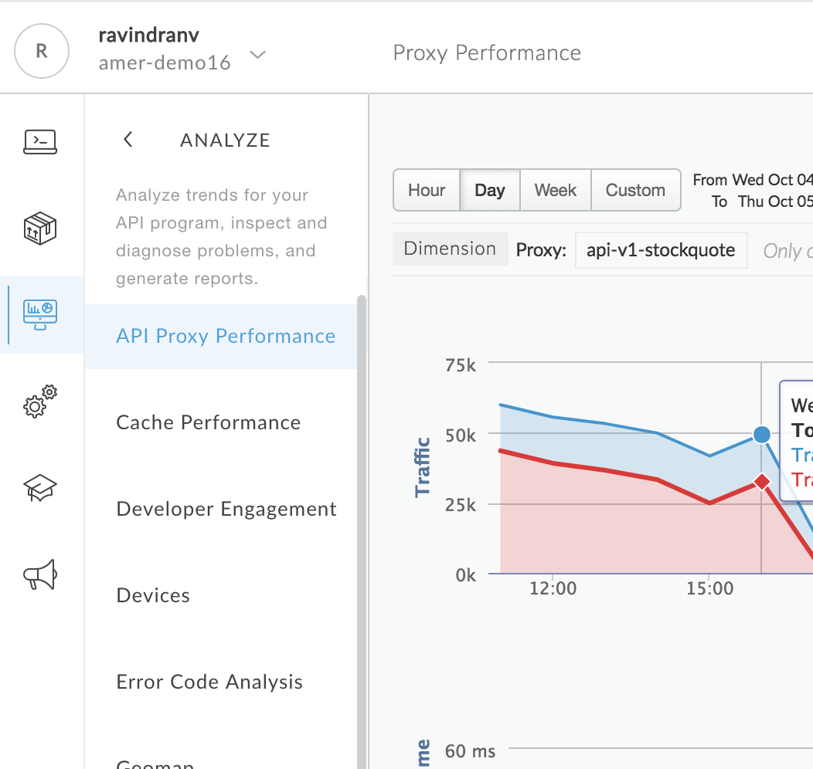

To access this section, navigate to the ‘Analyze’ tab on the left corner of the Management UI. This section provides access to real-time App and API related analytics dashboards with detailed metrics and drill-downs.  
このセクションにアクセスするには、管理UIの左隅にある「分析」タブに移動します。このセクションでは、詳細なメトリクスとドリルダウンを備えたリアルタイムの App および API 関連の分析ダッシュボードにアクセスできます。

### Organization Administration

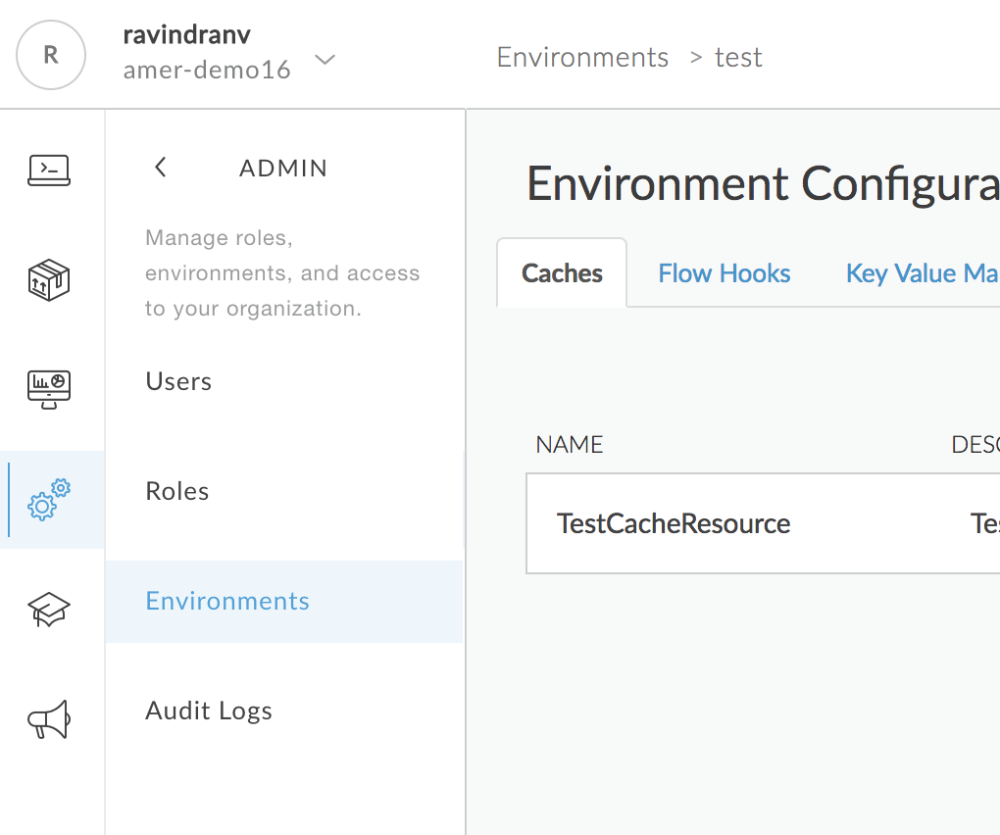

To access this section, navigate to the ‘Admin’ tab on the left corner of the Management UI. This section provides access to organization administration features such as environment configuration, platform user management and audit log.  
このセクションにアクセスするには、管理UIの左隅にある「管理者」タブに移動します。このセクションでは、環境設定、プラットフォームユーザー管理、監査ログなどの組織管理機能へのアクセスを提供します。

### Platform Help

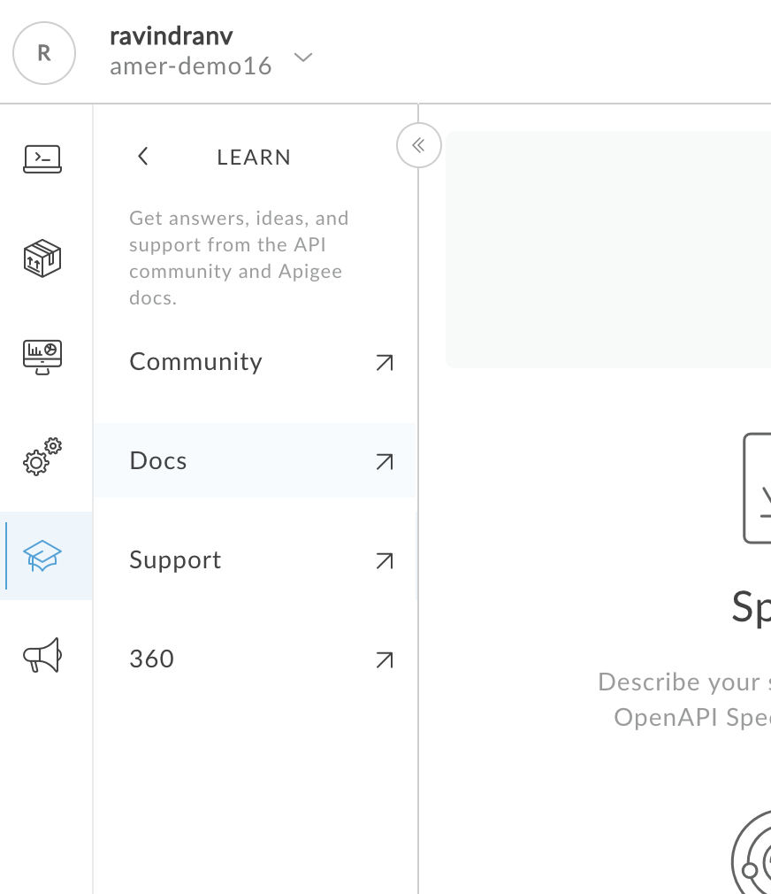

To access this section, navigate to the ‘Learn’ tab on the left corner of the Management UI. This section provides platform usage help in the form or Docs, Support, Apigee user Community portal, etc.  
このセクションにアクセスするには、管理UIの左隅にある「Learn」タブに移動します。このセクションでは、Docs、サポート、Apigeeユーザーコミュニティポータルなど、プラットフォームの使用方法についてのヘルプを提供します。

### What is an Apigee Edge ‘Organization’?

In Apigee Edge, an organization is a container for all the entities managed within the platform, including API proxies, API products, API packages, apps, developers, etc.  
Apigee Edgeでは、組織とは、APIプロキシ、API製品、APIパッケージ、アプリ、開発者など、プラットフォーム内で管理されるすべてのエンティティのコンテナのことを指します。

A user account is required for access to an organization. Within the Management UI, users can switch context between organizations to which they are a member.  
組織にアクセスするには、ユーザーアカウントが必要です。管理UI内では、ユーザーは、メンバーである組織間のコンテキストを切り替えることができます。

In addition, all users also have access to a ‘Personal Space’, which can be used for API design related operations.  
また、すべてのユーザーが「パーソナルスペース」にアクセスできるようになり、API設計関連の操作にも利用できるようになりました。

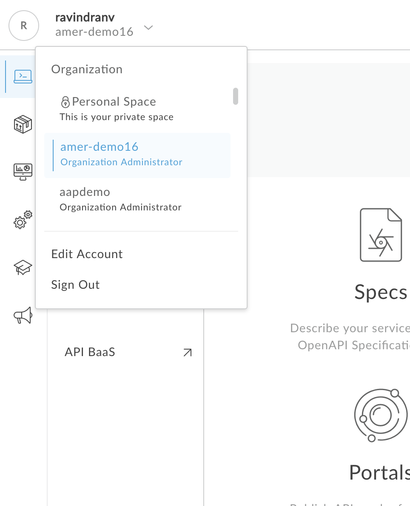

### What is an Apigee Edge ‘Environment’?

In Apigee Edge, an environment is a runtime execution context for API proxies. An API proxy must be deployed to an environment before the API it exposes is accessible over the network. Apigee customers have the flexibility to set up multiple environments. By default, organizations are provisioned with two environments: 'test' and 'prod'.  
Apigee Edgeでは、環境とはAPIプロキシのためのランタイム実行コンテキストのことです。APIプロキシが公開するAPIがネットワーク経由でアクセスできるようになる前に、APIプロキシを環境にデプロイする必要があります。Apigeeの顧客は、複数の環境を柔軟に設定することができます。デフォルトでは、組織には2つの環境が用意されています。「test」と「prod」の2つの環境が用意されている。  
The 'test' environment is typically used for deploying API proxies during development.  
「test」環境は通常、開発中のAPIプロキシのデプロイに使用されます。  
The 'prod' environment is typically used for promoting API proxies from the test environment after they have been fully developed and tested.  
「prod」環境は通常、API プロキシが完全に開発・テストされた後、テスト環境から API プロキシを推進するために使用されます。

### Understanding API Proxies, Policies & Flows

In Apigee Edge, an API proxy is a facade for one or more APIs, generic HTTP services, or applications (such as Node.js).  
Apigee Edgeでは、APIプロキシは1つまたは複数のAPI、汎用HTTPサービス、アプリケーション（Node.jsなど）のためのファサードです。  
The facade provided by an API proxy decouples the app developer and app client-facing API from the 'backend' functionality invoked for API execution, thereby shielding developers from code changes and enabling innovation at the edge without impacting your internal development teams. As development teams make backend changes, developers continue to call the same interface uninterrupted.   
APIプロキシによって提供されるファサードは、アプリ開発者とアプリのクライアント向けAPIを、API実行のために呼び出される「バックエンド」機能から切り離すことで、開発者をコード変更から守り、内部の開発チームに影響を与えることなく、エッジでのイノベーションを可能にします。開発チームがバックエンドの変更を行っても、開発者は中断することなく同じインターフェースを呼び出し続けることができます。  
Apigee enables you to expose multiple interfaces to the same API, freeing you to customize the signature of an API to meet the needs of various developer niches simultaneously.  
Apigeeは複数のインターフェースを同じAPIに公開することを可能にし、APIのシグネチャを自由にカスタマイズして様々な開発者のニーズを同時に満たすことができます。  
An API proxy is implemented as a set of configuration files, policies, and code that rely on a set of resources provided by Apigee Edge. API proxies can be generated and configured using the Apigee Edge management UI, or they can be implemented locally in a text editor or IDE.  
APIプロキシは、Apigee Edgeが提供する一連のリソースに依存する設定ファイル、ポリシー、コードのセットとして実装されます。APIプロキシはApigee Edgeの管理UIを使用して生成・設定することも、テキストエディタやIDEでローカルに実装することもできます。  

[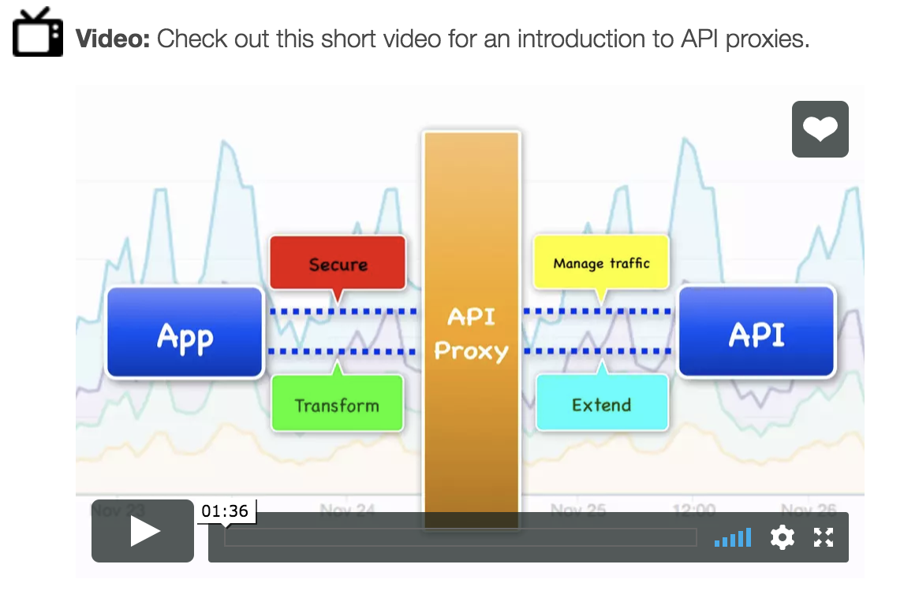](https://vimeo.com/113341767)

**API Policies**

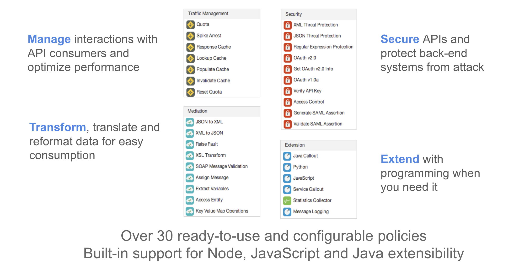

A policy is a processing step that executes as an atomic, reusable unit of logic within an API proxy processing flow.
ポリシーとは、APIプロキシ処理フロー内でアトミックで再利用可能な ロジックの単位として実行される処理ステップである。  
Typical policy-based functionality includes transforming message formats, enforcing access control, calling remote services for additional information, masking sensitive data from external users, examining message content for potential threats, caching common responses to improve performance, and so on.  
典型的なポリシーベースの機能には、メッセージフォーマットの変換、 アクセス制御の強制、追加情報のためのリモートサービスの呼び出し、 外部ユーザーからの機密データのマスク、潜在的な脅威のための メッセージコンテンツの検査、パフォーマンスを向上させるための共通の応答のキャッ シュなどがある。

Policies may be conditionally executed based on the content or context of a request or response message. For example, a transformation policy may be executed to customize a response format if the request message was sent from a smartphone.  
ポリシーは、リクエストまたは応答メッセージの内容またはコンテキストに基づいて条件付きで実行されてもよい。例えば、リクエストメッセージがスマートフォンから送信された場合、応答フォーマットをカスタマイズするために変換ポリシーが実行されてもよい。

**Proxy & Target Endpoints**

In an API proxy configuration, there are two types of endpoints: 

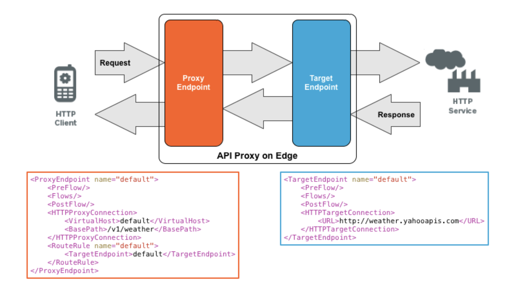

* **ProxyEndpoint**: Defines the way client apps consume your APIs. You configure the ProxyEndpoint to define the URL of your API proxy.  
クライアントアプリが API を消費する方法を定義します。API プロキシの URL を定義するために ProxyEndpoint を構成します。  
The proxy endpoint also determines whether apps access the API proxy over HTTP or HTTPS. You usually attach policies to the ProxyEndpoint to enforce security, quota checks, and other types of access control and rate-limiting.  
また、プロキシエンドポイントは、アプリが API プロキシに HTTP でアクセスするか HTTPS でアクセスするかを決定します。通常、ProxyEndpoint にポリシーをアタッチして、セキュリティ、クォータチェック、およびその他のタイプのアクセス制御やレート制限を実施します。  

* **TargetEndpoint**: Defines the way the API proxy interacts with your backend services.   
API プロキシがバックエンドサービスと相互作用する方法を定義します。  
You configure the TargetEndpoint to forward requests to the proper backend service, including defining any security settings, HTTP or HTTPS protocol, and other connection information.   
TargetEndpoint を構成して、セキュリティ設定、HTTP または HTTPS プロトコル、およびその他の接続情報の定義を含めて、適切なバックエンド サービスにリクエストを転送します。  
You can attach policies to the TargetEndpoint to ensure that response messages are properly formatted for the app that made the initial request.  
TargetEndpoint にポリシーを追加して、応答メッセージが最初のリクエストを行ったアプリのために適切にフォーマットされるようにすることができます。

**Flows**

Any application programming model includes a way to control the flow of processing. In an API proxy, that's done with flows. To flows you add logic, condition statements, error handling, and so on. You use flows to control what happens, and when.  
どんなアプリケーションプログラミングモデルにも、処理の流れを制御する方法が含まれています。APIプロキシでは、それはフローで行われます。フローにロジックや条件文、エラー処理などを追加します。何がいつ、何が起こるかを制御するためにフローを使用します。  
Flows are sequences of policies along the API request processing path. When you add a policuy, such as to verify an API key, you add it as a step in the sequence specified by a flow. When you define a condition to specify whether and when logic executes, you add the condition to a flow.  
フローはAPIリクエストの処理パスに沿ったポリシーのシーケンスです。API キーの検証などのポリシーを追加する場合は、フローで指定されたシーケンスのステップとして追加します。ロジックが実行されるかどうか、いつ実行されるかを指定する条件を定義すると、その条件をフローに追加します。  
When deciding where to add logic, you'll first choose whether to add it to a proxy endpoint or target endpoint. An API proxy divides its code between code that interacts with the proxy's client (proxy endpoint) and optional code that interacts with the proxy's backend target, if any (target endpoint).  
ロジックをどこに追加するかを決めるとき、まず最初にプロキシエンドポイントに追加するかターゲットエンドポイントに追加するかを選択します。API プロキシはそのコードを、プロキシのクライアントと対話するコード (プロキシエンドポイント) と、プロキシのバックエンドターゲット (もしあれば) と対話するオプションのコード (ターゲットエンドポイント) に分けます。  

Both endpoints contain flows, as described here:  
ここで説明するように、両方のエンドポイントにはフローが含まれています。  
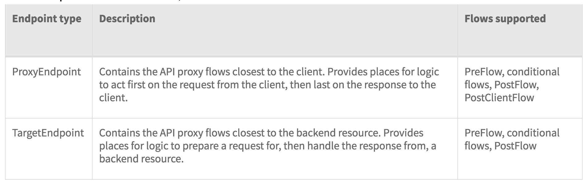
 
You configure flow with XML that specifies what should happen and in what order. The following illustration shows how flows are ordered sequentially within a proxy endpoint and target endpoint:  
何をどのような順序で行うかを指定する XML を使用してフローを構成します。次の図は、プロキシエンドポイントとターゲットエンドポイント内でフローがどのように順序付けられているかを示しています。  
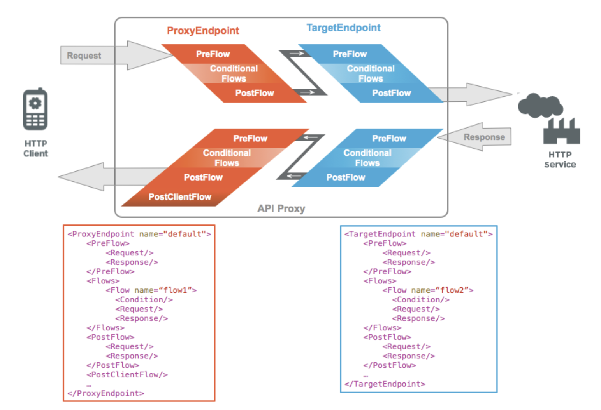

The proxy endpoint and target endpoint each contain flows that you can arrange in the following sequence:  
プロキシエンドポイントとターゲットエンドポイントには、それぞれ以下の順序で並べることができるフローが含まれています。  
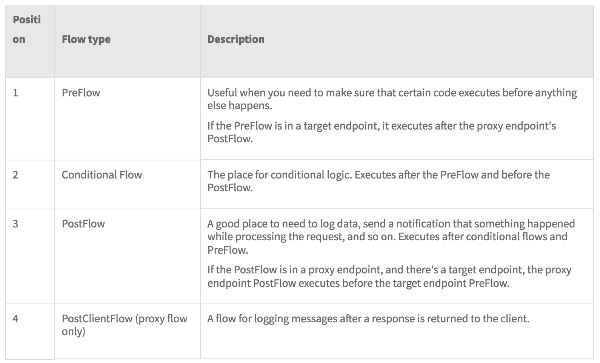

| Position | Flow type | Description |
----|----|---- 
| 1 | PreFlow | Useful when you need to make sure that certain code executes before anything else happens. 何かが起こる前に特定のコードが実行されることを確認する必要がある場合に便利です。|
|  |  | If the PreFlow is in a target endpoint, it executes after the proxy endpoint's PostFlow.  PreFlow がターゲットエンドポイントにある場合、プロキシエンドポイントの PostFlow の後に実行されます。 |
| 2 | Conditional Flow 条件付きフロー | The place for conditional logic. Executes after the PreFlow and before the PostFlow.  条件付き論理の場。PreFlow の後、PostFlow の前に実行します。 |
| 3 | PostFlow | A good place to need to log data, send a notification that something happened while processing the request, and so on. Executes after conditional flows and PreFlow. データをログに記録したり、リクエスト処理中に何かが起こったという通知を送ったりと、必要なものがあると良い場所です。条件付きフローやPreFlowの後に実行します。|
|  |  | If the PostFlow is in a proxy endpoint, and there's a target endpoint, the proxy endpoint PostFlow executes before the target endpoint PreFlow. PostFlow がプロキシエンドポイントにあり、ターゲットエンドポイントがある場合、プロキシエンドポイントの PostFlow はターゲットエンドポイントの PreFlow の前に実行されます。|
| 4 | PostClientFlow (proxy flow only) | A flow for logging messages after a response is returned to the client. 応答がクライアントに返された後にメッセージをログに記録するためのフローです。 |
