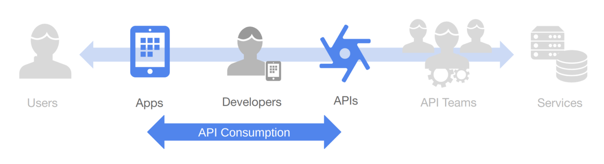
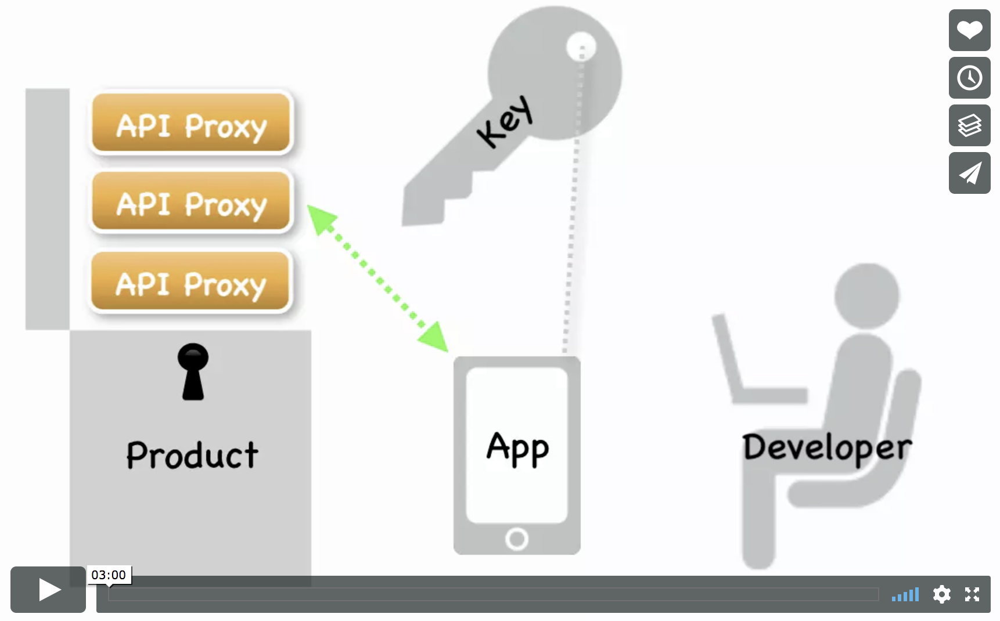
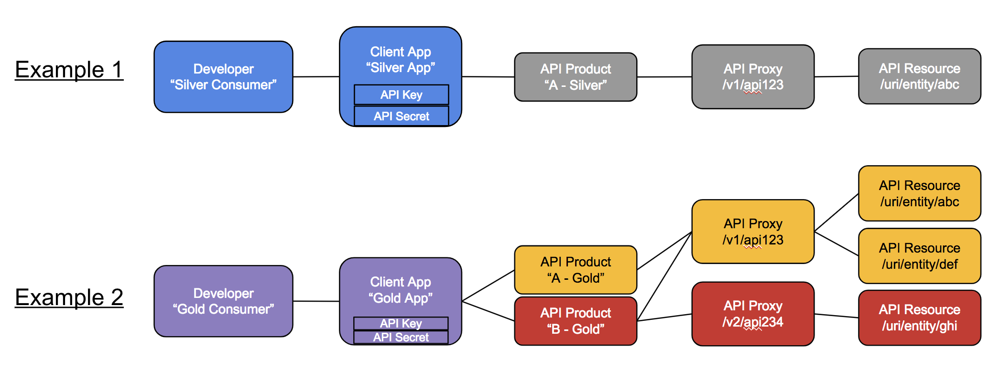
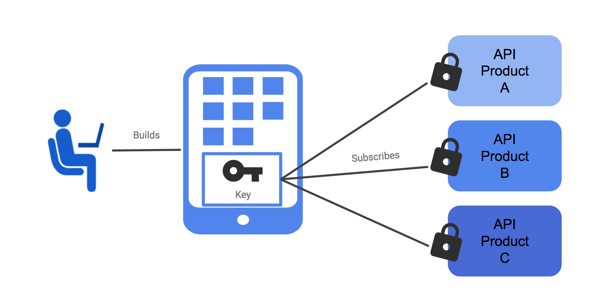
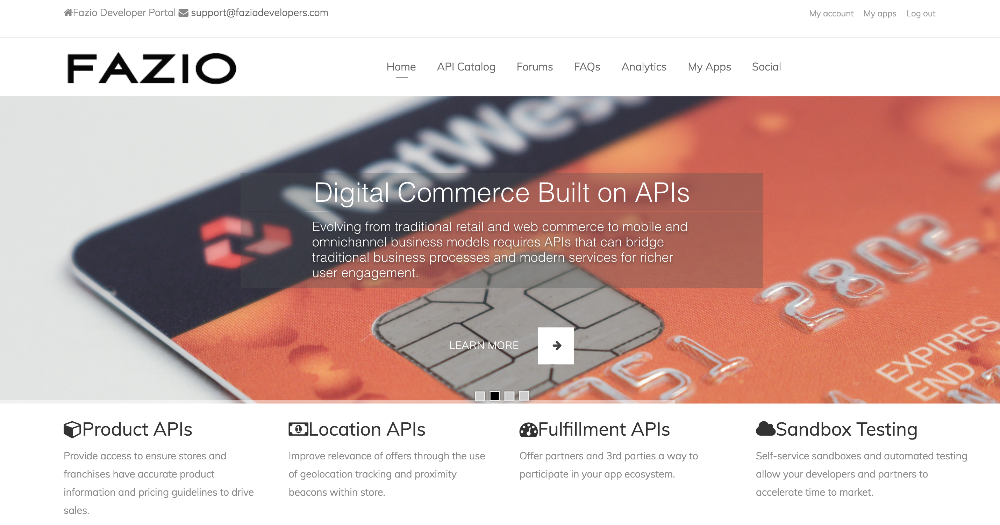
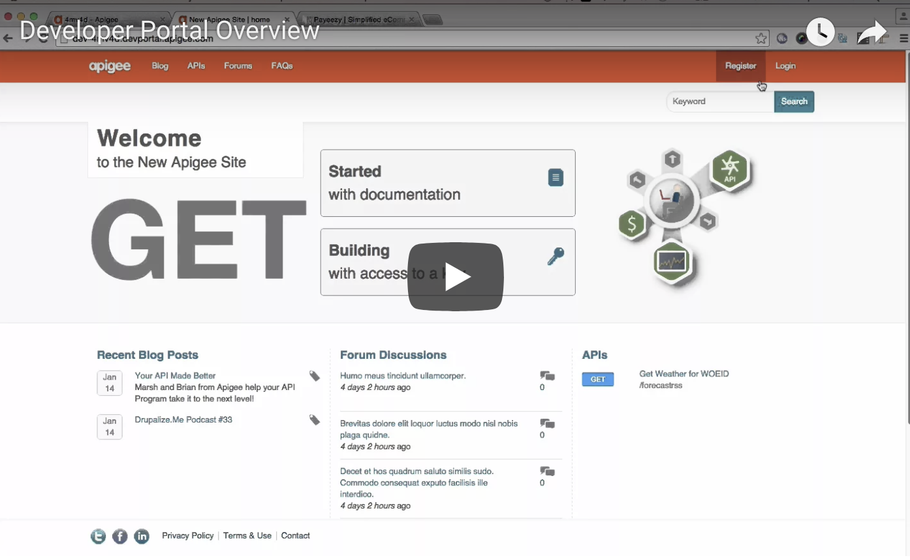
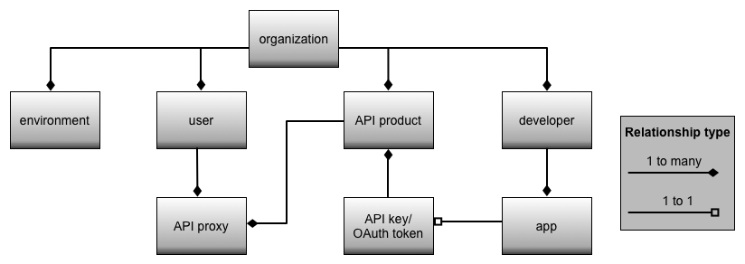

# Basic Concepts - Part 2  基本的な概念 - パート2

Here are some basic concepts to introduce you to API Publishing using the Apigee Edge API Management Platform.  
Apigee Edge API管理プラットフォームを利用したAPIパブリッシングの基本的な考え方をご紹介します。

**Contents**

* Publishing APIs using Apigee Edge  (Apigee Edgeを使用したAPIの公開)
* What is an API Product?  (APIプロダクトとは何ですか？)
* What is the Apigee Edge Developer Portal?  (Apigee Edge Developer Portalとは？)
* Relationship between Developers -> Apps -> API Keys -> API Products -> API Proxies

# Publishing APIs using Apigee Edge  
Apigee Edgeを使ったAPIの公開

Publishing is the process of making your APIs available to app developers for consumption. Publishing APIs involves the following tasks, described in this topic:  
パブリッシングとは、API をアプリ開発者が消費できるようにするためのプロセスです。API の公開には、このトピックで説明する以下のタスクが含まれます。

1. Create the API products on Edge that bundle your APIs.  
   APIをバンドルしたAPIプロダクトをEdge上で作成する。
2. Register app developers on Edge.  
   Edge上でアプリ開発者を登録する。
3. Register developer apps on Edge.  
   開発者アプリをEdgeに登録する。
4. Provide documentation and community support for your APIs.  
　APIのドキュメントとコミュニティサポートを提供します。

Here's a brief video to explain publishing on Apigee Edge:　　
Apigee Edgeでのパブリッシングを説明する簡単な動画です。

# What is an API Product?

An API product bundles API resources, such as API proxies and the API resource URIs that the proxy exposes, in order to provide a specific level of access and functionality for client app developers. An API product typically specifies a list of API proxies and API resource URIs, along with access limits, API key approval method, and other configuration that define how the bundled APIs can be used.  
APIプロダクトは、クライアントアプリ開発者に特定のレベルのアクセスと機能を提供するために、APIプロキシやプロキシが公開するAPIリソースURIなどのAPIリソースをバンドルする。APIプロダクトは通常、APIプロキシとAPIリソースURIのリストを、アクセス制限、APIキー承認方法、およびバンドルされたAPIの使用方法を定義するその他の設定とともに指定します。

Typically, this type of bundling allows API producers to decouple the development and production of the API, from the consumption of the API. By doing so, API producers are able to provide different access models and tiers for their APIs. Different API products - perhaps even bundling the same API proxies - provide service levels for different use cases. Instead of just giving developers a list of resources, you can bundle specific resources together to create a product that solves a specific user need.  
一般的に、このタイプのバンドルにより、API プロデューサは API の開発と生産を API の消費から切り離すことができます。そうすることで、API プロデューサは API に異なるアクセスモデルや階層を提供することができます。異なる API プロダクト（おそらく同じ API プロキシをバンドルしたものであっても）は、異なるユースケースに対応したサービスレベルを提供します。開発者にリソースのリストを与えるだけではなく、特定のリソースをバンドルして、特定のユーザーのニーズを解決するプロダクトを作成することができます。

### API Keys

On Apigee Edge, API proxies bundled within API products, can be accessed using an API key. Each client application registered by app developers on Edge, is assigned an API key and API secret. This app credential pair allows access to one or more API products.  
Apigee Edge上では、APIプロダクトにバンドルされているAPIプロキシにAPIキーを利用してアクセスすることができます。Edge上のアプリ開発者が登録した各クライアントアプリケーションには、APIキーとAPIシークレットが割り当てられます。このアプリのクレデンシャルペアにより、1つ以上のAPIプロダクトへのアクセスが可能になります。

# What is the Developer Portal?

Developer portals with social publishing features are increasingly being used for communication with the developer community. This includes communicating static content, such as API documentation and terms-of-use, as well as dynamic community-contributed content such as blogs and forums.  
ソーシャルパブリッシング機能を備えた開発者ポータルは、開発者コミュニティとのコミュニケーションにますます利用されるようになってきています。これには、API ドキュメントや利用規約などの静的なコンテンツだけでなく、ブログやフォーラムなどの動的なコミュニティ貢献コンテンツのコミュニケーションも含まれます。 

As an API provider, you need a way to expose your APIs, educate developers about your APIs, sign up developers, and let developers register apps. Exposing your APIs to developers is only part of creating a truly dynamic community. You also need a way for your developer community to provide feedback, make support and feature requests, and submit their own content that can be accessed by other developers.  
API プロバイダとしては、API を公開し、開発者に API に関する教育を行い、開発者をサインアップし、開発者がアプリを登録できるようにする方法が必要です。API を開発者に公開することは、真のダイナミックなコミュニティを作るためのほんの一部に過ぎません。また、開発者コミュニティがフィードバックを提供したり、サポートや機能のリクエストをしたり、他の開発者がアクセスできるような独自のコンテンツを提出したりする方法も必要です。

Apigee Edge provides you with a Developer Portal that you can use to build and launch your own customized website to provide all of these services to your development community. Every Edge customer can create their own developer portal, either in the cloud or on-prem. This Developer Portal comes pre-built with Interactive Open API Spec based API documentation, API subscription self-service, Role-based access control, and many more features.  
Apigee Edgeでは、開発者コミュニティにこれらのサービスを提供するために、独自のカスタマイズされたWebサイトを構築して立ち上げることができる開発者ポータルを提供しています。Edgeのお客様は、クラウドまたはオンプレミスのいずれかで、独自の開発者ポータルを作成することができます。この開発者ポータルには、インタラクティブなオープンAPI仕様ベースのAPIドキュメント、APIサブスクリプションのセルフサービス、役割ベースのアクセス制御など、さまざまな機能があらかじめ組み込まれています。

# Relationship between Developers -> Apps -> API Keys -> API Products -> API Proxies

The following image depicts the relationship between the different configuration entities on Apigee Edge, i.e. app developers, apps, API keys, API products and API proxies.  
次の図は、Apigee Edge上のさまざまな設定エンティティ（アプリ開発者、アプリ、APIキー、APIプロダクト、APIプロキシなど）の関係を表しています。

## For further information on Apigee Edge Basic Concepts, please visit:

* [Apigee Edge Docs - Basic Concepts](https://docs.apigee.com/api-services/content/basic-concepts)
* [Apigee Community - Programming of APIs 4 minute video series](https://community.apigee.com/articles/35881/apigee-4mv4d-programming-of-apis-series.html)

