# API Design : Create a Reverse Proxy from OpenAPI Spec  
 API設計 . OpenAPI仕様からリバースプロキシを作成する

*Duration : 10 mins* 

*Persona : API Team*

# Use case

You have a requirement to create a reverse proxy for taking HTTP requests from the Internet and forwarding them to an existing backend service.  
インターネットからHTTPリクエストを受け取り、既存のバックエンドサービスに転送するためのリバースプロキシを作成する必要があります。

You have decided to follow a design first approach & build a reusable component, a specification which can be used to build API proxies, generate API documentation, and generate API test cases using OpenAPI Specification format.  
デザイン・ファースト・アプローチに従うことを決め、再利用可能なコンポーネント、APIプロキシの構築、APIドキュメントの生成、OpenAPI仕様フォーマットを使用したAPIテストケースの生成に使用できる仕様を構築することにしました。

You would like to generate an Apigee API Proxy by using the OpenAPI Specification (Swagger) instead of building the API Proxy from scratch.  
APIプロキシをスクラッチから構築するのではなく、OpenAPI Specification (Swagger)を使用してApigee APIプロキシを生成したいと考えています。

# How can Apigee Edge help? Apigee Edgeはどのように役立ちますか？

Apigee Edge enables you to quickly expose backend services as APIs.  
Apigee Edgeを使用すると、バックエンドサービスをAPIとして素早く公開することができます。

You do this by creating an API proxy that provides a facade for the backend service that you want to expose.  
APIプロキシを作成して、公開したいバックエンドサービスのファサードを提供します。

Apigee Edge out of the box supports the OpenAPI specification, allowing you to auto-generate API proxies.  
Apigee EdgeはOpenAPI仕様をサポートしており、APIプロキシを自動生成することができます。 

Apigee Edge also has an OpenAPI specification editor & store which you can use to maintain your OpenAPI specifications.  
Apigee EdgeにはOpenAPI仕様エディタとストアもあり、OpenAPI仕様を維持するために使用することができます。

The API proxy decouples your backend service implementation from the API that developers consume.  
APIプロキシは、バックエンドサービスの実装と開発者が消費するAPIを切り離します。 

This shields developers from future changes to your backend services.  
これにより、開発者はバックエンドサービスへの将来の変更を防ぐことができます。

As you update backend services, developers, insulated from those changes, can continue to call the API uninterrupted.  
バックエンドサービスを更新しても、開発者は変更から隔離されているので、APIを中断することなく呼び出し続けることができます。

In this lab, we will see how to create a reverse proxy that routes inbound requests to existing HTTP backend services using a readily available OpenAPI specification.  
このラボでは、すぐに利用可能な OpenAPI 仕様を使用して、既存の HTTP バックエンドサービスにインバウンドリクエストをルーティングするリバースプロキシの作成方法を見ていきます。

# Pre-requisites    前提条件

Basic understanding of [OpenAPI Specification](https://github.com/OAI/OpenAPI-Specification) (Swagger)
OpenAPI仕様の基本的な理解

# Instructions

* Go to [https://apigee.com/edge](https://apigee.com/edge) and log in. This is the Edge management UI. 

* Select **Develop → Specs** in the side navigation menu

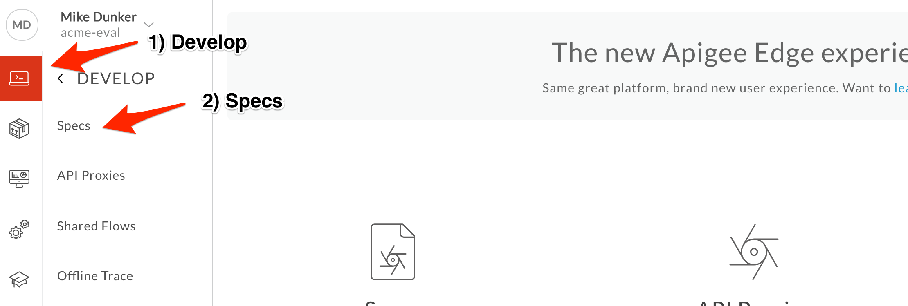

* Click **+Spec.** Click on **Import URL** to add a new spec from existing source.

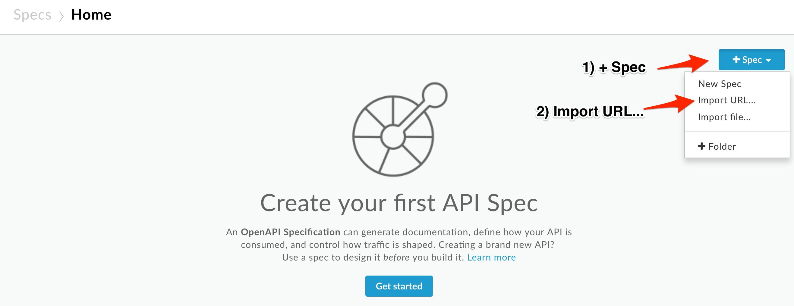

* Enter the spec details.

  * File Name: Employee Backend

  * URL: [https://raw.githubusercontent.com/apigeekdemos/virtual-apijam/master/Resources/employee-openapi-spec.yaml](https://raw.githubusercontent.com/apigeekdemos/virtual-apijam/master/Resources/employee-openapi-spec.yaml)

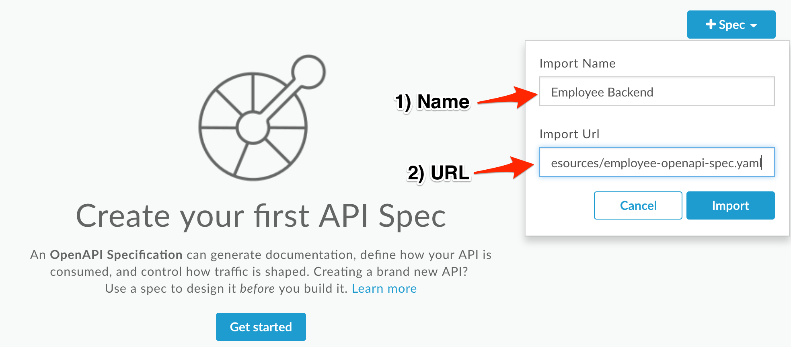

**	**

* Verify the values and click **Import**.

* Spec has been imported into Apigee Edge & Ready to use. You should see your spec in the list.  
  SpecはApigee Edge & Ready to useにインポートされました。リストに自分のspecが表示されているはずです。

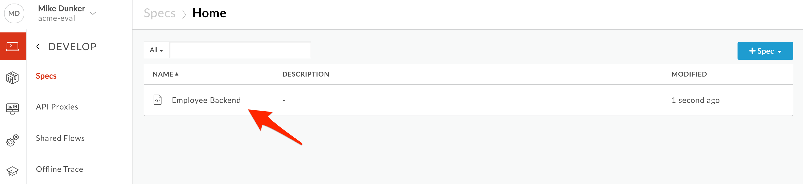

* Click on the spec from the list to access the OpenAPI spec editor and interactive documentation that lists the backend API details and resources.  
リストから仕様をクリックすると、バックエンドAPIの詳細とリソースを一覧表示するOpenAPI仕様エディタとインタラクティブなドキュメントにアクセスできます。

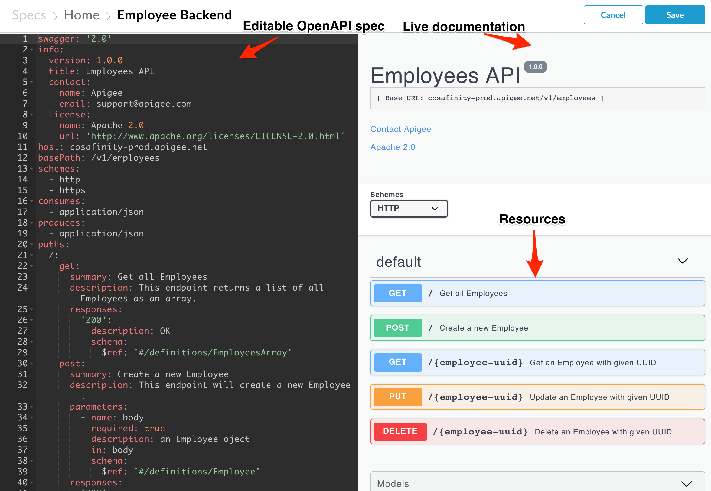

* It’s time to create Apigee API Proxy from Open API Spec.  
  Open API SpecからApigee API Proxyを作成する時期になりました。  
  Click on **Develop > API Proxies** from side navigation menu.

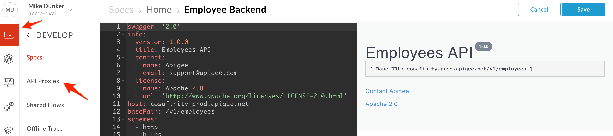

* Click **+Proxy** The Build a Proxy wizard is invoked. 
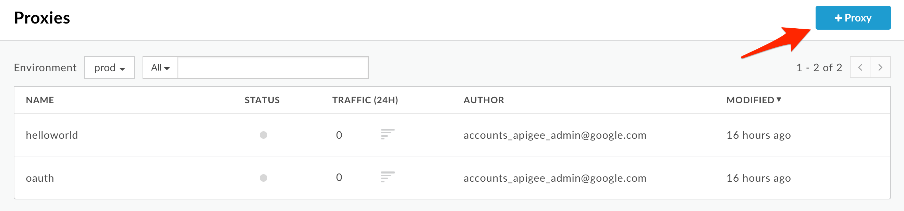

* Select **Reverse proxy**, Click on **Use OpenAPI** below reverse proxy option.

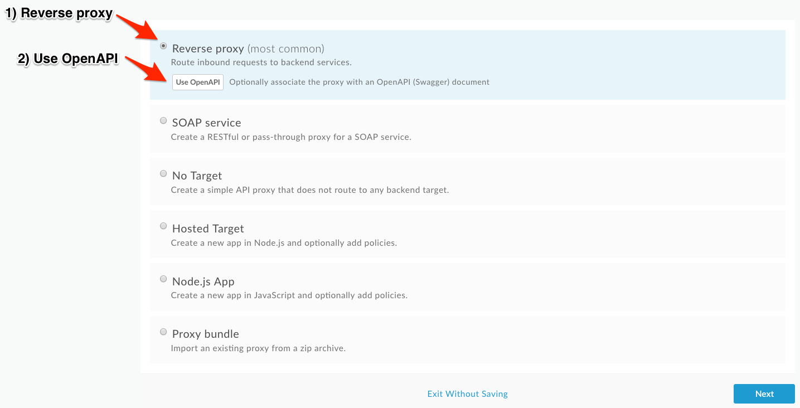

* You should see a popup with list of specs.  
  スペックのリストがポップアップで表示されるはずです。  
  Select **Employee Backend** and click **Select.** 

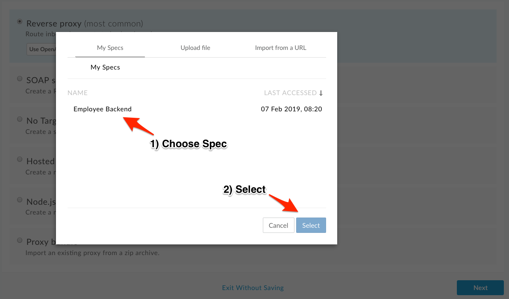

* You can see the selected OpenAPI Spec URL below the Reverse Proxy option, Click **Next** to continue.  
  Reverse Proxy オプションの下に選択した OpenAPI Spec URL が表示されます。

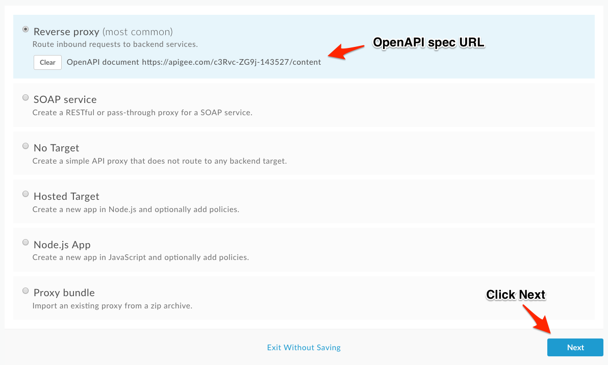

* Enter the proxy name, base path, and description. This is the first version of our Employees API, so we'll make it version プロキシ名、ベースパス、説明文を入力します。これは、従業員APIの最初のバージョンです。  

1. When you enter the proxy name, the proxy base path will automatically be populated, but you'll need to change the hyphen before the version to a forward slash.  
プロキシ名を入力すると、プロキシのベースパスが自動的に入力されますが、バージョンの前のハイフンをフォワードスラッシュに変更する必要があります。

  * Proxy Name: employees-v1

  * Proxy Base Path: /employees/v1

  * Existing API: Observe the field value which is auto filled from OpenAPI Spec.  
    既存のAPIです。OpenAPI Specから自動入力されるフィールド値を監視します。

  * Description: Employees API v1

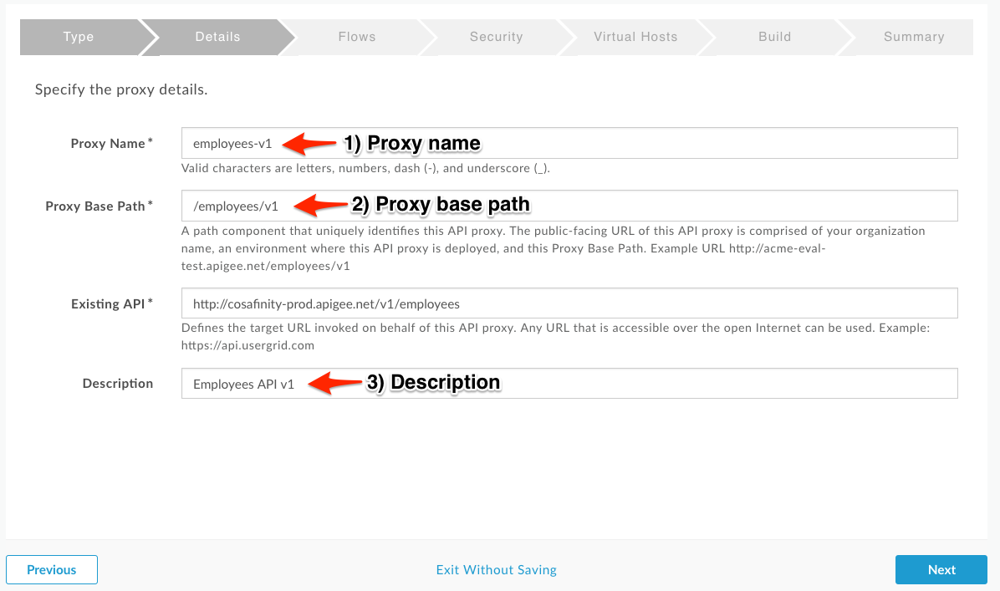

* Verify the values and click **Next**.  
  値を確認して、クリックします。

* You can select, de-select list of API Proxy Resources that are pre-filled from the OpenAPI Spec. Make sure all resources are selected and click on **Next**.  
* OpenAPI仕様書から事前に入力されているAPIプロキシリソースのリストを選択、選択解除することができます。全てのリソースが選択されていることを確認し、**Next**をクリックします。

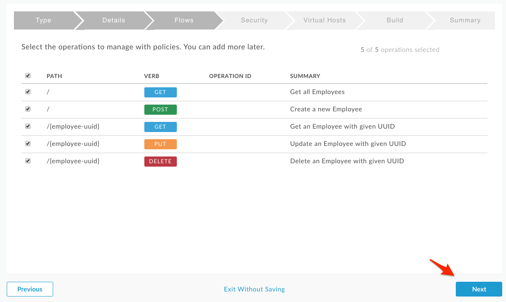

* Select **Pass through (none)** for the authorization in order to choose not to apply any security policy for the proxy.  
プロキシにセキュリティポリシーを適用しないことを選択するには、認証に**Pass through (none)**を選択します。
Click **Next**.
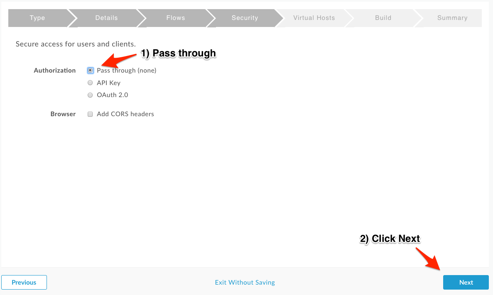

* The next pane allows us to decide whether the proxy will be available over http (default), https (secure), or both.  
次のペインでは、プロキシをhttp(デフォルト)、https(セキュア)、またはその両方で利用できるようにするかどうかを決定できます。  

In this case, our API deals with employee data. This is generally sensitive information, so we will only allow access via https.  
この場合、APIは従業員のデータを扱っています。これは一般的に機密情報なので、https経由でのアクセスのみを許可します。  

If we allowed access via http, all traffic to and from the API would be in plaintext across the internet.  
http 経由でのアクセスを許可した場合、API との間のすべてのトラフィックは、インターネット上のプレーンテキストになります。  

Unless there is a specific requirement to expose a specific API via http, you should always only allow access via https.  
特定の API を http 経由で公開するという特別な要件がない限り、常に https 経由でのアクセスのみを許可する必要があります。  

**Uncheck the default virtual host and click Next**.  
デフォルトのバーチャルホストのチェックを外して、Nextをクリックします。
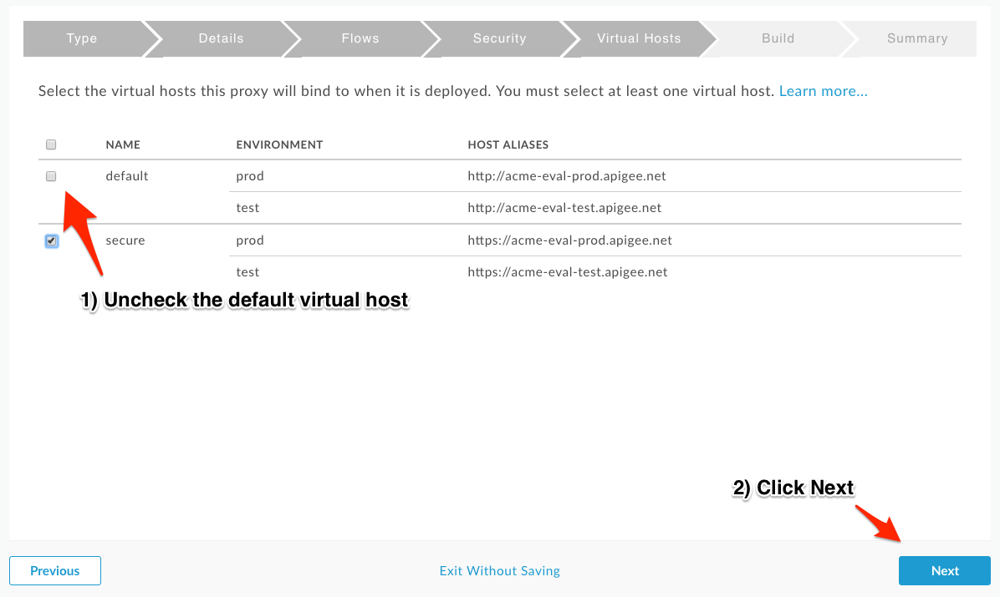

* The proxy is certainly not ready to deploy to production yet! Ensure that only the **test** environment is selected and click **Build and Deploy**.  
プロキシはまだ本番環境にデプロイする準備ができていません。test**環境のみが選択されていることを確認して、 **Build and Deploy**をクリックしてください。
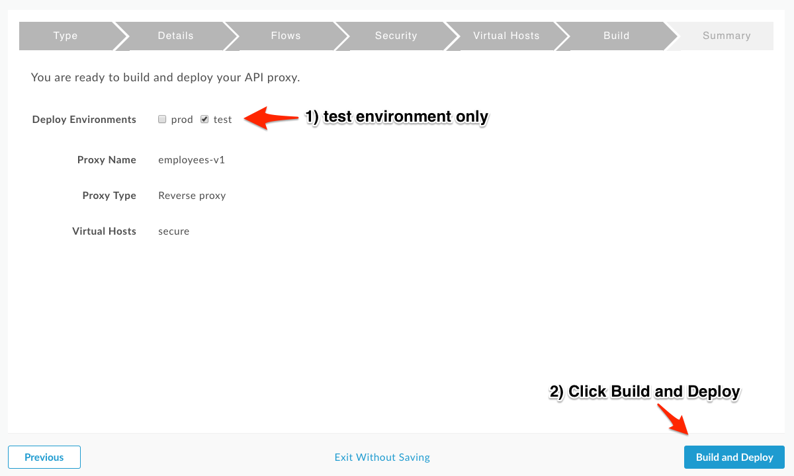

* You should see that the proxy has been generated, uploaded, and deployed to test. Once the API proxy is built and deployed, click the **employees-v1** link to view your proxy in the proxy editor.  
  プロキシが生成され、アップロードされ、テスト用にデプロイされたことが確認できます。APIプロキシをビルドしてデプロイしたら、**employees-v1**リンクをクリックして、プロキシエディタでプロキシを表示します。

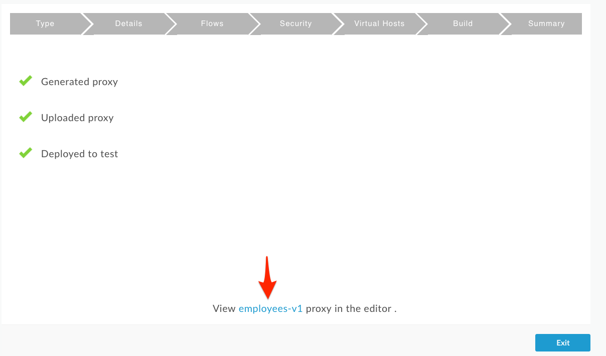

* You should see the proxy **Overview** screen.  
プロキシの**Overview**画面が表示されるはずです。
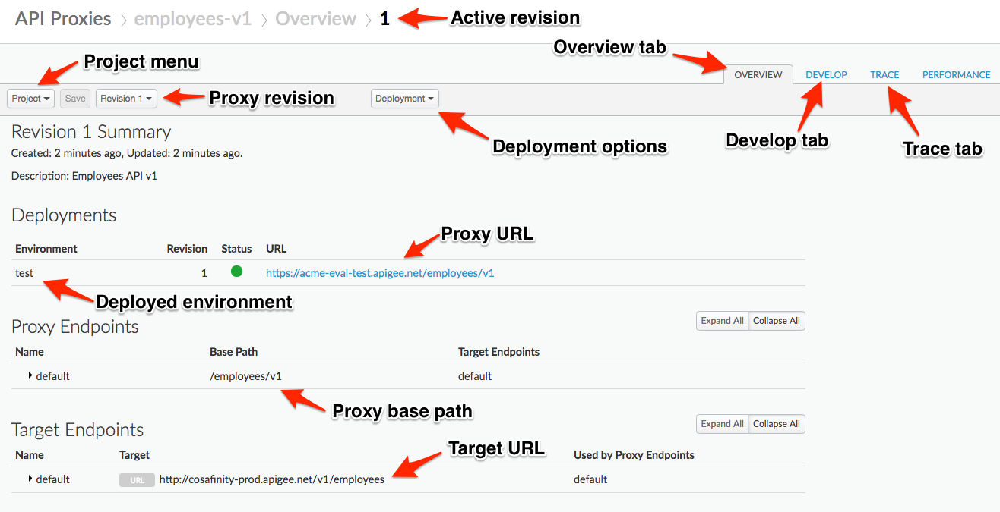

* *Congratulations!* ...You have now built a reverse proxy for an existing backend service.  
おめでとうございます！ ...これで、既存のバックエンドサービスのリバースプロキシが構築できました。

* Let us test the newly built API proxy using the [Apigee REST Client](https://apigee-restclient.appspot.com/). Open the REST Client in a new browser window.  
[Apigee REST Client](https://apigee-restclient.appspot.com/)を使って、新しく構築したAPIプロキシをテストしてみましょう。新しいブラウザウィンドウでRESTクライアントを開きます。

* Copy the URL for your API proxy. 

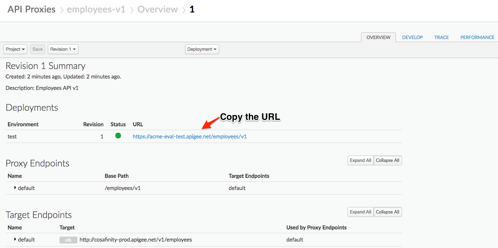

* Paste the link into the REST Client and make a GET call

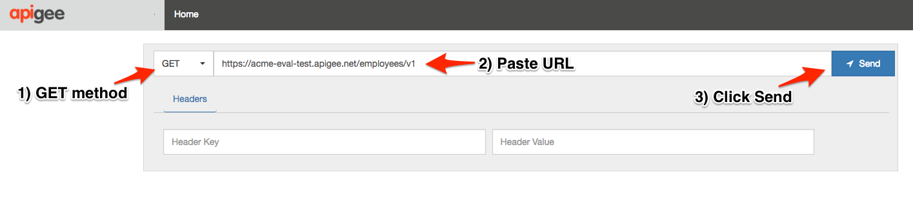

* You should see a success response similar to this:
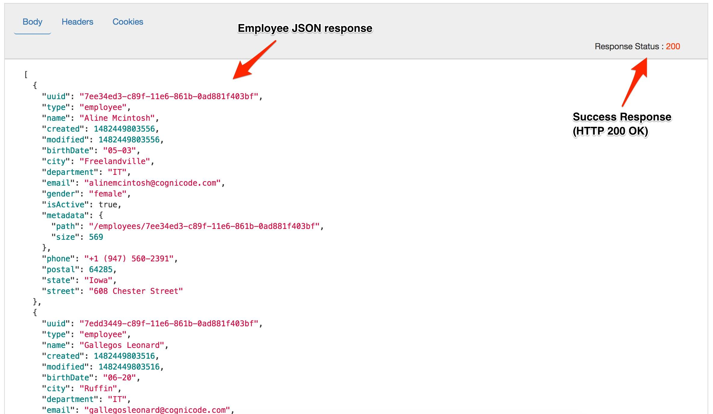

# Download the API Proxy

* Let’s download the API Proxy locally as an API Bundle so that we can reuse it in other labs.  
API プロキシをローカルに API バンドルとしてダウンロードして、他のラボで再利用できるようにしましょう。

* Download the API Proxy by downloading the current revision of the proxy. Return to the Overview tab, and see screenshot below for instructions.  
API プロキシの現在のリビジョンをダウンロードして、API プロキシをダウンロードします。概要タブに戻り、手順は以下のスクリーンショットを参照してください。

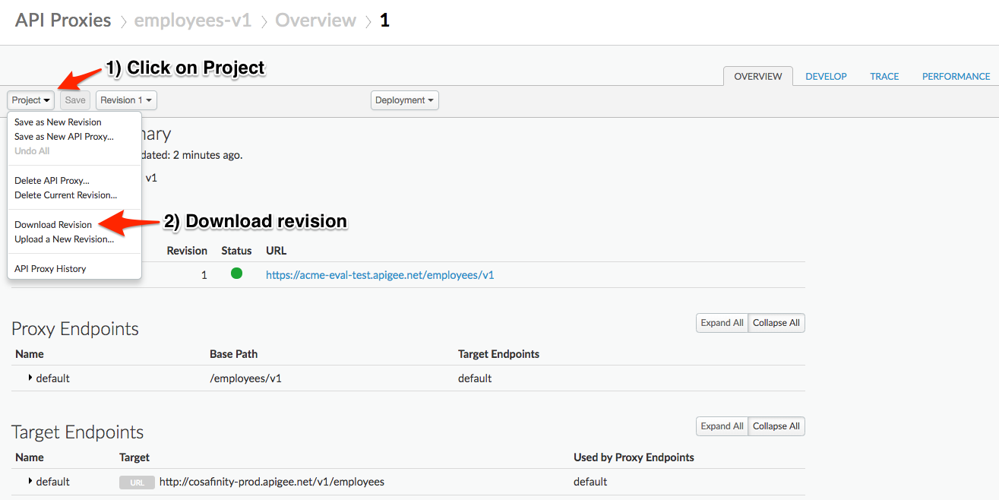

# Lab Video

If you like to learn by watching, here is a short video on creating a reverse proxy using an Open API Specification - [https://youtu.be/3XBG9QOUPzg](https://youtu.be/3XBG9QOUPzg)   
見て学ぶのが好きな方は、Open API 仕様を使ったリバースプロキシの作成についての短いビデオがあります - [https://youtu.be/3XBG9QOUPzg](https://youtu.be/3XBG9QOUPzg) 

# Earn Extra-points  エクストラポイントを獲得する

* Now that you have created a reverse proxy using an OpenAPI spec, click on the "Develop" tab and explore the flow conditions populated from the OpenAPI spec. Also, explore the OpenAPI Spec editor where you can edit the OpenAPI specification and test the API requests. Finally, explore the "Trace" tab in the proxy overview page.  
OpenAPI 仕様を使用してリバースプロキシを作成したので、「開発」タブをクリックして OpenAPI 仕様から生成されたフロー条件を調べます。また、OpenAPI 仕様を編集したり、API リクエストをテストしたりできる OpenAPI 仕様エディタを探索します。最後に、プロキシの概要ページの「トレース」タブを探索します。

# Quiz

1. How do you import the proxy bundle you just downloaded?  
   ダウンロードしたばかりのプロキシバンドルをインポートするには？
2. How does Apigee Edge handle API versioning?  
   Apigee EdgeはAPIのバージョニングをどのように処理しますか？
3. Are there administrative APIs to create, update and delete API proxies in Apigee?  
   ApigeeでAPIプロキシを作成、更新、削除するための管理用APIはありますか？

# Summary  まとめ

That completes this hands-on lesson. In this simple lab you learned how to create a proxy for an existing backend using an OpenAPI Specification and the Apigee proxy wizard.  
以上でこのハンズオンレッスンは終了です。この簡単なラボでは、OpenAPI仕様とApigeeプロキシウィザードを使って既存のバックエンドのプロキシを作成する方法を学びました。

# References  参考文献

* Useful Apigee documentation links on API proxies:  
APIプロキシに関する有用なApigeeドキュメントのリンク

    * Build a simple API Proxy - [https://docs.apigee.com/api-platform/fundamentals/build-simple-api-proxy](https://docs.apigee.com/api-platform/fundamentals/build-simple-api-proxy) 

    * Best practices for API proxy design and development - [https://docs.apigee.com/api-platform/fundamentals/best-practices-api-proxy-design-and-development](https://docs.apigee.com/api-platform/fundamentals/best-practices-api-proxy-design-and-development) 

* Watch this 4minute video on the "Anatomy of an API proxy" - [https://youtu.be/O5DJuCXXIRg](https://youtu.be/O5DJuCXXIRg) 

# Rate this lab

How did you like this lab? Rate [here](https://goo.gl/forms/G8LAPkDWVNncR9iw2).

Now go to [Lab-2](../Lab%202%20API%20Security%20-%20Securing%20APIs%20with%20API%20Keys)

