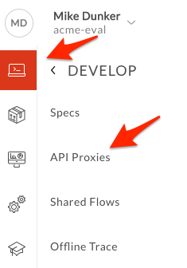
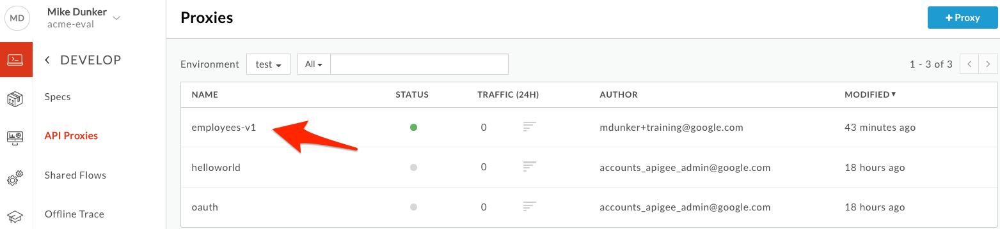
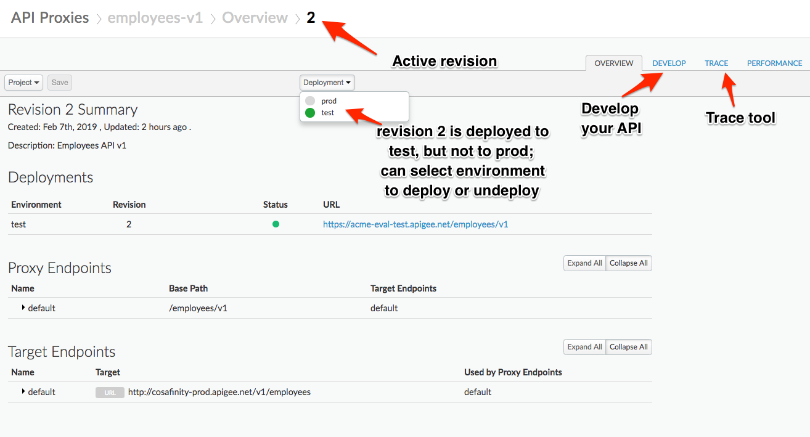
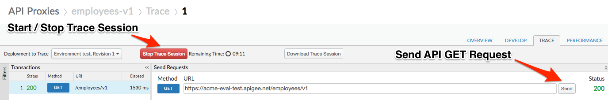
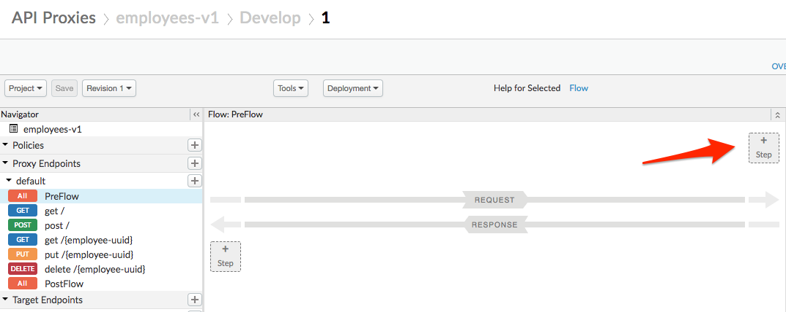
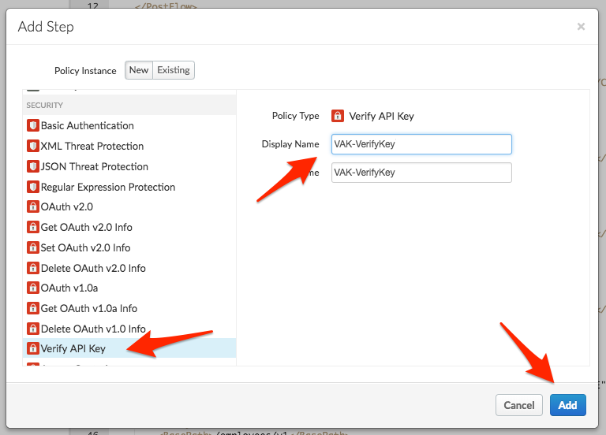
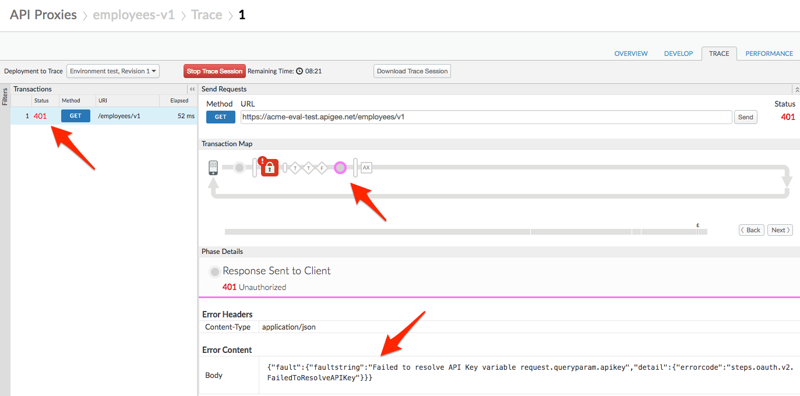

# API Security : Securing APIs with API Keys

*Duration : 10 mins*

*Persona : API Team*

# Use case

You have an API proxy that you want to secure, so that you can manage access and perform business logic based on the client making the call.  In addition to authorizing users, you want to know which developer app is making calls so you can leverage that data to customize your API behavior based on the entitlement level of the caller, or even the specific caller.  You also would like to be able to see who is calling your API proxies in your Analytics dashboards.  
呼び出しを行うクライアントに基づいてアクセスを管理し、ビジネスロジックを実行できるようにするために、セキュアにしたいAPIプロキシがあるとします。 ユーザーの認証に加えて、どの開発者アプリが呼び出しを行っているかを知りたい場合は、そのデータを活用して呼び出し元のエンタイトルメント・レベルや特定の呼び出し元に基づいてAPIの動作をカスタマイズすることができます。 また、アナリティクスのダッシュボードで誰がAPIプロキシを呼び出しているのかを確認できるようにしたい場合もあります。

# How can Apigee Edge help?

The [Verify API Key Policy](http://docs.apigee.com/api-services/reference/verify-api-key-policy) in Edge authenticates that the call is coming from an approved application in a valid state.  App developers who wish to access secure operations must request [API keys](https://docs.apigee.com/api-platform/security/api-keys) for their apps via the developer portal.  
Edgeの[Verify API Key Policy](http://docs.apigee.com/api-services/reference/verify-api-key-policy)は、有効な状態で承認されたアプリケーションからの呼び出しであることを認証します。 セキュアな操作にアクセスしたいアプリ開発者は、開発者ポータルからアプリの[APIキー](https://docs.apigee.com/api-platform/security/api-keys)を要求する必要があります。

In addition to authenticating requests, the [Verify API Key Policy](https://docs.apigee.com/api-platform/reference/policies/verify-api-key-policy) provides context about the app making the call.  This context can be used to apply policies such as quota enforcement or routing based on the client app.  Upon successful verification of the API Key, the API Context is populated with details about the app, developer, and API product associated with the call.  This data can be used for applying business logic as well as gaining business insights through analytics.  
リクエストの認証に加えて、[Verify API Key Policy](https://docs.apigee.com/api-platform/reference/policies/verify-api-key-policy)は、呼び出しを行うアプリに関するコンテキストを提供します。 このコンテキストは、クライアントアプリに基づいてクォータの実施やルーティングなどのポリシーを適用するために使用できます。 API キーの検証が成功すると、API コンテキストには、呼び出しに関連するアプリ、開発者、および API 製品の詳細が入力されます。 このデータは、ビジネスロジックを適用したり、分析を通じてビジネスの洞察を得るために使用できます。

In this lab, you will protect an existing API proxy with the [Verify API Key Policy](https://docs.apigee.com/api-platform/reference/policies/verify-api-key-policy) and use the trace tool to see the policy in action.  To accomplish this you will modify an existing API proxy to add a security policy to handle the authorization.  
このラボでは、既存の API プロキシを [Verify API Key Policy](https://docs.apigee.com/api-platform/reference/policies/verify-api-key-policy) で保護し、トレースツールを使用してポリシーの動作を確認します。 これを達成するために、既存の API プロキシを修正して、認証を処理するためのセキュリティポリシーを追加します。  

# Pre-requisites 前提条件

For this lab, you will need an API proxy that is not currently secured.  If you do not have an API proxy available for this lab, revisit the lab "API Design : Create a Reverse Proxy from OpenAPI Spec" and then return here to complete these steps.  
このラボでは、現在セキュアではないAPIプロキシが必要です。 このラボで利用可能な API プロキシがない場合は、ラボの「API デザイン . OpenAPI Specからリバースプロキシを作成する」を参照し、ここに戻ってこれらの手順を完了してください。

# Instructions

## Choose (and invoke) an API Proxy to secure  
セキュアなAPIプロキシを選択(呼び出し)する

* Go to [https://apigee.com/edge](https://apigee.com/edge) and log in. This is the Edge management UI

* Select **Develop → API Proxies**



* Select the **employees-v1** proxy that you created in an earlier lab exercise.  
以前のラボの演習で作成した**employees-v1**プロキシを選択します。



* Verify that the API proxy is deployed to an environment from the **Overview** page.  Environment(s) to which the selected revision of the API proxy is deployed will be indicated by a green circle.  If it is not deployed, click an environment from the "Deployment" pull-down to deploy the API proxy to that environment.  
APIプロキシがある環境にデプロイされていることを**Overview**ページから確認してください。 選択したリビジョンのAPIプロキシがデプロイされている環境が緑色の丸で表示されます。 配置されていない場合は、「配置」プルダウンから環境をクリックして、その環境にAPIプロキシを配置します。



* Verify that you can successfully make calls using the built-in trace tool.  
  内蔵のトレースツールを使用して正常に通話ができることを確認します。

* Click the **Trace** tab near the top of the window.  
  ウィンドウの上部近くにある「**Trace**」タブをクリックします。

* The Trace view allows you to initiate tracing for up to 10 minutes, during which time all requests (regardless of whether they are sent from the trace tool or any other client) will be captured and their traces made visible to you.  
その間、トレースツールや他のクライアントから送信されたかどうかに関わらず、すべてのリクエストがキャプチャされ、そのトレースが可視化されます。  

* Click **Start Trace Session** to begin a trace session.  
  トレースセッションを開始するには、**Start Trace Session**をクリックします。

* Click **Send** to send a request.  If your API proxy requires query parameters add them here prior to sending.  
  リクエストを送信するには **Send** をクリックします。 API プロキシがクエリパラメータを必要とする場合は、送信前にここに追加してください。

* You should see a successful 2xx response for your API Call (it may take a few seconds for the trace results to appear)  
  API コールに対する成功した 2xx レスポンスが表示されるはずです（トレース結果が表示されるまでに数秒かかる場合があります）



## Add a Verify API Key Policy  
APIキーの検証ポリシーを追加する

* Menu: **Develop > API Proxies**

* Open your API proxy and click the **Develop** tab (in the upper right area of the page) to see the flow editor (you may have to move the panes to see the full request and response flow lines)  
APIプロキシを開き、**Develop**タブ(ページの右上エリア)をクリックしてフローエディタを表示します(リクエストとレスポンスのフローライン全体を見るためにペインを移動する必要があるかもしれません)

* Click **+Step** on the request flow.  
リクエストフローの**+Step**をクリックします。



* Select *Verify API Key* policy from the *Security* section of the list.  The name can be changed or left at the default.  
  リストの*Security*セクションから*Verify API Key*ポリシーを選択します。 ポリシー名は変更したり、デフォルトのままにしておくことができます。

* Click **Add**



* The policy will be added after any policies you previously had in the Request flow.  Since we likely want this to occur first, drag the new policy to be the leftmost of any policies in the flow.  
このポリシーは、リクエストフローで以前に持っていたポリシーの後に追加されます。 これを最初に行いたいので、新しいポリシーをフロー内のどのポリシーよりも左端になるようにドラッグしてください

* With the *Verify API Key* policy selected, you can see its configuration (the default policy configuration is below).  Note that the API Key is being retrieved from the context as the variable *request.queryparam.apikey*.  This is the default but the policy can be configured to retrieve the key from any parameter key you prefer.  
* Verify API Key*ポリシーが選択された状態で、その設定を確認することができます(デフォルトのポリシー設定は以下の通りです)。 APIキーは、コンテキストから変数*request.queryyparam.apikey*として取得されていることに注意してください。 これがデフォルトですが、任意のパラメータキーからキーを取得するようにポリシーを設定することができます。

```
<?xml version="1.0" encoding="UTF-8" standalone="yes"?>
  <VerifyAPIKey async="false" continueOnError="false" enabled="true" name="VAK-VerifyKey">
    <DisplayName>VAK-VerifyKey</DisplayName>
     <Properties/>
    <APIKey ref="request.queryparam.apikey"/>
</VerifyAPIKey>
```

* **Save** the API proxy.

* Click the **Trace** tab near the top of the window.

* Click **Start Trace Session** to begin a trace session.

* Click **Send** to send a request.  

* You should see a 401 (unauthorized) response for your API Call because the API proxy was expecting an API Key as a query parameter.  See the trace session below  
API プロキシがクエリパラメータとして API キーを期待していたため、API コールに対して 401 (不正) レスポンスが表示されるはずです。 以下のトレースセッションを参照してください。

* NOTE: In Lab 4, you will get an API Key that will allow you to make this API call successfully.  
注: Lab 4 では、この API 呼び出しを成功させるための API キーを取得します。



# Lab Video

If you would rather watch a video that covers this topic, point your browser [here](https://youtu.be/3nUFCOgGlS8). (note: you only need to watch until the 3:00 minute mark for this specific lab).  
このトピックをカバーするビデオをご覧になりたい場合は、ブラウザの [ここ] (https://youtu.be/3nUFCOgGlS8) をポイントしてください。(注意: この特定の研究室では3:00分までしか見てはいけません)

# Quiz

1. Why is the Verify API Key policy typically found as the first policy in the Request PreFlow?  When might it be in a conditional PreFlow instead of the "All" PreFlow?  
  Verify API Keyポリシーは、通常、Request PreFlowの最初のポリシーとして見られるのはなぜですか？ Verify API Key ポリシーが "All" PreFlow ではなく、条件付き PreFlow にあるのはどのような場合ですか？

2. How would you configure the policy to get the API Key from a header called "Api-Key" instead of the default query parameter location?  
　　デフォルトのクエリパラメータの場所ではなく、"API-Key "と呼ばれるヘッダーからAPIキーを取得するようにポリシーを設定するにはどうすればよいでしょうか？

# Summary

In this lab you learned how to protect your API proxy using the Verify API Key policy.  You implemented the policy and tested it using the built-in Trace Tool.  
このラボでは、Verify API Keyポリシーを使用してAPIプロキシを保護する方法を学びました。 ポリシーを実装し、組み込みのトレースツールを使ってテストしました。

# References  参考文献

* Link to Apigee docs page

    * Verify Api Key Policy [https://docs.apigee.com/api-platform/reference/policies/verify-api-key-policy](https://docs.apigee.com/api-platform/reference/policies/verify-api-key-policy)

# Rate this lab

How did you like this lab? Rate [here](https://goo.gl/forms/XxDqVtWHnyFdEChv1).

Now go to [Lab-3](../Lab%203%20API%20Publishing%20-%20API%20Products%20and%20Developer%20Portals)

