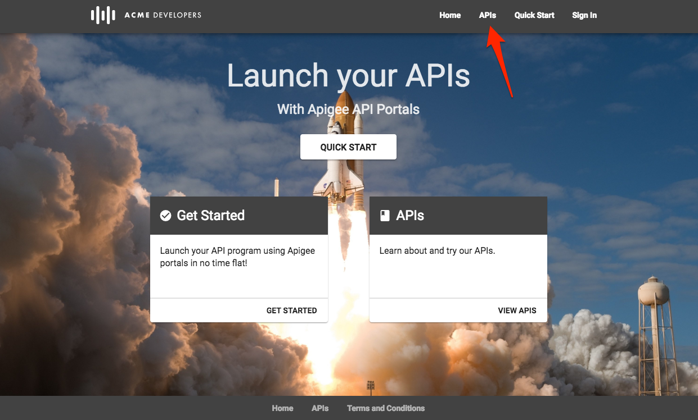

# API Publishing: API Products and Developer Portals

*Duration : 15 mins*

*Persona : API Team*

# Use case

You have an API proxy that you would like to share with app developers via a Developer Portal.  You want to enable developers to learn about, register for, and begin using your API proxy.  
開発者ポータルを介してアプリ開発者と共有したいAPIプロキシがあります。 開発者がAPIプロキシについて学び、登録し、使用を開始できるようにしたいと考えています。

# How can Apigee Edge help?  
  Apigee Edgeはどのように役立ちますか？

Apigee Edge provides multiple options for your Developer Portal.  There is a lightweight portal that supports branding and customization of much of the site, such as theme, logos, and page content.  The lightweight portal can be published in seconds, directly from the management UI.  We also provide a Drupal-based portal if you want full control and to leverage any of the hundreds of Drupal modules available in the Drupal Market.  This lab focuses on the lightweight Apigee Developer Portal.  
Apigee Edgeには、デベロッパーポータル用の複数のオプションが用意されています。 テーマ、ロゴ、ページコンテンツなど、サイトの大部分のブランディングやカスタマイズをサポートする軽量ポータルがあります。 軽量ポータルは、管理UIから直接、数秒で公開することができます。 また、完全にコントロールしたい場合や、Drupal マーケットで利用できる何百ものDrupalモジュールのいずれかを活用したい場合には、Drupalベースのポータルも提供しています。 このラボでは、軽量な Apigee Developer Portal に焦点を当てます。

In this lab, you will create a Developer Portal and publish an OpenAPI specification that can be used by developers.  
このラボでは、デベロッパーポータルを作成し、デベロッパーが使用できるOpenAPI仕様を公開します。

# Pre-requisites  前提条件

For this lab, you will need…  
このlabに必要なものは...

* An OpenAPI specification uploaded to your Organization.  This specification will make up the documentation of your API proxy.  If you do not have an OpenAPI Specification available for this lab, revisit the lab *API Design : Create a Reverse Proxy from OpenAPI Spec* and then return here to complete these steps.  
組織にアップロードされた OpenAPI 仕様書。 この仕様書は、APIプロキシのドキュメントを構成します。 このラボで使用できる OpenAPI 仕様がない場合は、ラボの *API Design を参照してください。OpenAPI 仕様からリバースプロキシを作成する* を参照してから、ここに戻ってこれらの手順を完了してください。

# Instructions

## Publish API as part of API Product  
APIをAPIプロダクトの一部として公開する

API products (which contain API proxies) are the unit of deployment to the Developer Portal, where App Developers can learn about, register for, and consume your APIs.  Read more about API products [here](https://docs.apigee.com/api-platform/publish/what-api-product).  
API製品（APIプロキシを含む）は、デベロッパーポータルへのデプロイの単位であり、アプリ開発者がAPIについて学習し、登録し、消費することができます。 API 製品についての詳細は[こちら](https://docs.apigee.com/api-platform/publish/what-api-product)をご覧ください

* Select **Publish → API Products** from the side navigation menu

* Click  **+API Product**

* Populate the following fields  次のフィールドを入力します。

    * Section: Product details

        * Name: employee-product
        
        * Display name: Employee Product

        * Description: Access the Employee API

        * Environment: test

        * Access: Public

    * Section: API resources

        * Section: API Proxies

            * Click the **Add a proxy** link

            

            * Select your Employee API Proxy and click **Add**.

            

* **Save** the API Product.

Note: We are adding the entire API Proxy to the API Product.  We can just as easily select one or more operations from one or more API proxies and bundle them together in an API Product.  
注: API プロキシ全体を API プロダクトに追加しています。 1つまたは複数のAPIプロキシから1つまたは複数の操作を選択してAPIプロダクトにバンドルすることができます。

## Publish a new Portal on Apigee Edge  
Apigee Edge上で新しいポータルを公開する

* Select **Publish → Portals → +Portal**

* Enter details in the portal creation wizard. Replace **{your-initials}** with the initials of your name and replace **{api_proxy_name}** with the name of the proxy.  
ポータル作成ウィザードで詳細を入力します。**{your-initials}**を名前のイニシャルに置き換え、**{api_proxy_name}**をプロキシ名に置き換えます。

  * Name: Employee API Portal

  * Description: Employee APIs

* Click **Create**

## Publish an API Product to the Portal  
ポータルにAPI製品を公開する

* Click the Portal Editor’s dropdown and select **APIs**.  
ポータル・エディタのドロップダウンをクリックして、**API**を選択します。

* Click **+API** to select an API Product to publish to the Portal.  
  **+API** をクリックして、ポータルに公開するAPI製品を選択します。

* Select the API Product to publish and click **Next**.  
  公開するAPI製品を選択して、**Next** をクリックします。

* Click the **Spec Source** dropdown and select **Choose a different spec...**.

* Select the OpenAPI Specification to use as a source. (NOTE: technically, you should update the "host:" and "path:" variables in your OpenAPI Spec that you created in Lab 1 so they now point to your API proxy hosted on Apigee, as well as add the API key you have in your proxy to the spec. However, for the purposes of this lab, it is also OK to use your existing OpenAPI Spec as is.) The current version (snapshot) of the selected OpenAPI Specification will be used to generate the documentation for this API product in the portal.  
ソースとして使用する OpenAPI 仕様を選択します。(注意: 技術的には、ラボ 1 で作成した OpenAPI Spec の "host:" と "path:" 変数を更新して、Apigee でホストされている API プロキシを指すようにし、プロキシにある API キーを spec に追加する必要があります。ただし、このラボの目的のために、既存の OpenAPI Spec をそのまま使用しても構いません)。選択した OpenAPI 仕様の現在のバージョン（スナップショット）は、ポータルでこの API 製品のドキュメントを生成するために使用されます。

* Select the "Anonymous users (anyone can view)" option so anyone can view this API through the portal. Click **Finish** to publish the API product (and OpenAPI Specification Snapshot) to the Developer Portal.  
匿名ユーザー（誰でも閲覧可能）」オプションを選択して、誰もがポータルを通じてこのAPIを閲覧できるようにします。終了**をクリックして、API製品（およびOpenAPI仕様スナップショット）を開発者ポータルに公開します。

* You should now see your new API Product published to the portal.  
  これで、ポータルに公開された新しい API 製品が表示されるはずです。

* Click the **Live Portal** link to launch a browser tab/window with the new Developer Portal.  
  新しい開発者ポータルのブラウザタブ/ウィンドウを起動するには、**Live Portal** リンクをクリックします。

* In the Portal UI, click **APIs** to view the products that have been published. Products are used to bundle APIs together so that a developer can request access to a set of related functionality without registering for each API.  They are also useful for managing access to, and quotas for, particular developers.  For more on API products, [read this document](https://docs.apigee.com/api-platform/publish/what-api-product).

* The Portal will display live documentation based on the OpenAPI Specification. The left pane is an index of the resources and API calls documented. The center pane shows the documentation for the selected item. The right pane allows the user to try out the API. Select the first API documented in the left pane. This API returns a list of all employees. Depending on the method, you’d expect to see model details, response codes, etc., as per the [OpenAPI Specification](https://github.com/OAI/OpenAPI-Specification/blob/master/versions/2.0.md). Try the API yourself using the right pane.  
ポータルには、OpenAPI 仕様に基づいたライブドキュメントが表示されます。左側のペインは、ドキュメント化されたリソースと API 呼び出しのインデックスです。中央のペインは、選択した項目のドキュメントを表示します。右側のペインでは、ユーザーがAPIを試すことができます。左ペインで最初にドキュメント化されたAPIを選択します。このAPIは、全従業員のリストを返します。メソッドによっては、[OpenAPI仕様](https://github.com/OAI/OpenAPI-Specification/blob/master/versions/2.0.md)の通り、モデルの詳細やレスポンスコードなどが表示されると思います。右ペインを使って自分でAPIを試してみてください。  

# Lab Video

If you would rather watch a video that covers this topic, point your browser [here](https://youtu.be/_gDpzDJPNQg). (note: instead of using the "Street Carts" sample, use the "Employee API" that you have built in Lab 1).  
このトピックをカバーするビデオを見たい場合は、ブラウザの [ここ](https://youtu.be/_gDpzDJPNQg) をポイントしてください。(注意: "Street Carts" サンプルを使用する代わりに、ラボ 1 で作成した "Employee API" を使用してください)。

# Earn Extra-points  エクストラポイントを獲得する

* Add a second product to the portal and test it by launching the Live Portal.  
  2つ目の製品をポータルに追加し、ライブポータルを起動してテストします。

* Update your API specification, and then [take a snapshot](https://docs-new.apigee.com/publish-apis#take-snapshot) of the specification to update the portal documentation.   
  APIの仕様を更新し、仕様の[スナップショットを取る](https://docs-new.apigee.com/publish-apis#take-snapshot)でポータルのドキュメントを更新します。

# Quiz

1. What are two reasons why you might publish multiple API products to the Developer Portal?  
   複数のAPI製品をDeveloper Portalに公開する可能性がある2つの理由とは？

2. Changes made to OpenAPI Specification are made available in the Developer Portal automatically.  True or False?  
   OpenAPI仕様の変更は自動的にデベロッパーポータルで利用できるようになります。 真か偽か?

# Summary

You’ve learned how to do the following:  
以下の手順を学習しました。

* Deploy the Apigee Lightweight Developer Portal  
  Apigee Lightweight Developer Portal のデプロイ

* Publish an API Product with an OpenAPI Specification  
  OpenAPI仕様でAPI製品を公開する

* Use the Developer Portal UI to browse the OpenApi Specification Snapshot as a developer.  
  開発者ポータルUIを使用して、開発者としてOpenApi仕様スナップショットを閲覧します。

# Rate this lab  
この lab を評価する

How did you link this lab? Rate [here](https://goo.gl/forms/j33WG2U0NFf02QHi1).

Now go to [Lab-4](../Lab%204%20API%20Consumption%20-%20Developers%20and%20Apps)
