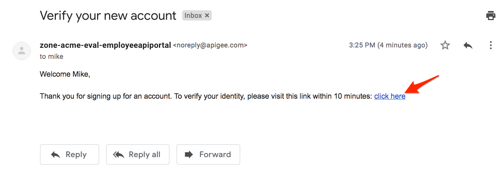
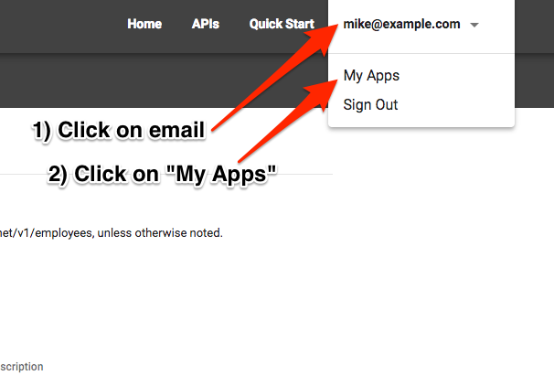
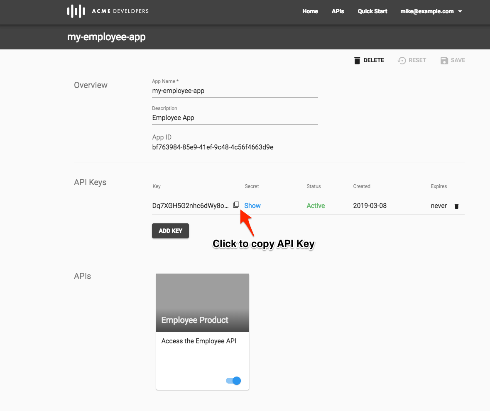

# API Consumption : Developers and Apps 

*Duration : 15 mins*

*Persona : Developer*

# Use case

As an app developer you would like to learn about APIs exposed by the API Team using API Documentation. Register using the Developer Portal to get access to the APIs exposed by the API Team.  
アプリ開発者として、API ドキュメントを使用して API チームが公開している API について学びたいと思います。開発者ポータルに登録して、APIチームが公開しているAPIにアクセスしてください。

# How can Apigee Edge help?

Apigee Edge has an out-of-the-box lightweight Developer Portal which allows the API Team to publish API Documentation. As an app developer you can self register with API Platform. Once logged in, you can create apps to get API keys.  API keys can be used to access protected APIs.  
Apigee Edgeには、APIチームがAPIドキュメントを公開するための軽量な開発者ポータルが用意されています。アプリ開発者としてAPI Platformに自己登録することができます。ログインすると、APIキーを取得するためのアプリを作成することができます。 API キーは、保護された API にアクセスするために使用できます。

In this lab, we will see how to register as an app developer, create an app in the Developer Portal to access API keys, and test the APIs using the keys we got from the Developer Portal.  
このラボでは、アプリ開発者として登録し、デベロッパーポータルでアプリを作成してAPIキーにアクセスし、デベロッパーポータルで取得したキーを使ってAPIをテストする方法を見ていきます。

# Pre-requisites  前提条件

*API Security* and *API Publishing* lab exercises.   
*APIセキュリティ* と *APIパブリッシング*のラボ演習。

# Instructions

* Go to [https://login.apigee.com/](https://login.apigee.com/) and log in.

* Select **Publish → Portals** in the side navigation menu. Select the developer portal that you created in earlier lab exercise.	
サイドナビゲーションメニューの **Publish → Portals** を選択します。以前のラボの演習で作成した開発者ポータルを選択します。


* Click on the **Live Portal** link to access the Developer Portal to start interacting as a developer.  
 **Live Portal** リンクをクリックして、開発者ポータルにアクセスし、開発者としての対話を開始します。


* In this lab, we will play the role of an app developer who would like to access the APIs and API Documentation.  
  このラボでは、APIとAPIドキュメントにアクセスしたいアプリ開発者の役割を果たします。

* Let’s register as an app developer by clicking on the **Sign In** link on the home page.  
  ホームページの**Sign In**リンクをクリックして、アプリ開発者として登録してみましょう。


* In the **Sign In** page, click on **Create account**


* Fill in the details and then click on **Create Account**


* As the message indicates, check your inbox to view the confirmation email.  
  メッセージにあるように、確認メールを見るために受信箱にチェックを入れてください。


* Click on the verification link in your confirmation email to verify your account. You will be redirected back to the developer portal.  
確認メールに記載されている確認リンクをクリックして、アカウントを確認してください。開発者ポータルに戻ります。



* Once again, click on the **Sign In** button, then fill in your Developer Portal credentials to log into the portal.  
  もう一度、**Sign In** ボタンをクリックして、Developer Portal の資格情報を入力してポータルにログインします。


* Note that the **Sign In** button has been replaced with your email, indicating a successful login.  
  ログインが成功したことを示す **Sign In** ボタンが電子メールに置き換えられていることに注意してください。


* Click on the **APIs** link in the top menu to view the list of API products associated to this portal.  
  上部メニューの**APIs**リンクをクリックすると、このポータルに関連するAPI製品のリストが表示されます。


* Click on the employee product to view the API Product documentation.  
  従業員製品をクリックすると、API製品のドキュメントが表示されます。


* Go through API Documentation to view the list of APIs and visualize the API Request and Response.  
  API ドキュメントを参照して、API の一覧を表示し、API のリクエストとレスポンスを可視化します。


* Let’s **create** a developer app.

Typically, developers who want to consume APIs go to the developer portal and register to use them. When registering, the developer gets to select which of the API products he or she wishes to use. For example, some products may be offered for free, while others require payment depending on a service plan. Upon completion, this registration step produces an Edge entity called a **developer app**. A developer app includes the products the developer selected and a set of API keys that the developer will be required to use to access the APIs that are associated with those products.   
通常、APIを利用したい開発者は、開発者ポータルにアクセスし、登録してAPIを利用します。登録の際に、開発者はどのAPI製品を利用したいかを選択することができます。例えば、製品によっては無料で提供されるものもあれば、サービスプランに応じて支払いが必要なものもあります。この登録ステップが完了すると、**開発者アプリ**と呼ばれるEdgeエンティティが生成されます。開発者アプリには、開発者が選択した製品と、それらの製品に関連するAPIにアクセスするために必要なAPIキーのセットが含まれます。

* To Create an app, Click on your **Email Address** & then **My Apps** in the top menu bar.　　
  アプリを作成するには、**メールアドレス**をクリックし、上部メニューバーの**マイアプリ**をクリックします。



* Click on **+ New App** to create an app.


* Fill in the app's name, description, and click on the toggle to enable access to the Employee product.  Click on the **Create** button to create a new developer app.  
アプリの名前、説明を入力し、トグルをクリックして、Employee製品へのアクセスを有効にします。 新規開発者アプリを作成するには、**Create** ボタンをクリックします。


* After the app has been created, the app page will now have a new section containing the API key. Copy the key, which can be used to make secured API calls.  
アプリが作成されると、アプリのページにAPIキーを含む新しいセクションが追加されます。安全なAPIコールを行うために使用できるキーをコピーします。



* From the main Apigee UI (not the Developer Portal), go back to the Employee API you've already created and click the **Trace** tab in the upper right.  
  ApigeeのメインUI（Developer Portalではありません）から、既に作成したEmployee APIに戻り、右上の**Trace**タブをクリックします。

* Click **Start Trace Session** to begin a trace session.  
トレースセッションを開始するには、**Start Trace Session**をクリックします。

* Click **Send** to send a request. (Do not add the API key to the query string yet). You should see a 401 (Unauthorized) response for your API call because the API proxy was expecting an API key as a query parameter.  See the trace session below.  
リクエストを送信するには、**Send**をクリックします。(クエリ文字列にAPIキーを追加しないでください)。API プロキシがクエリパラメータとして API キーを期待していたため、API コールに対して 401 (Unauthorized) 応答が表示されるはずです。 これはAPIプロキシがクエリパラメータとしてAPIキーを期待していたからです。

* Now add the query parameter ```?apikey={your_api_key}``` to the URL in the trace tool and try again.  (Replace ```{your_api_key}``` with the API key you just copied in this lab and resend the request. You should see a 2xx response code and the Trace for that request should show that the Verify API Key policy is now passing.  
トレースツールのURLにクエリパラメータ```?apikey={your_api_key}```を追加して、もう一度試してみてください。 (```{your_api_key}```をこの研究室でコピーしたAPIキーに置き換えて、リクエストを再送信してください。2xxのレスポンスコードが表示され、そのリクエストのトレースはVerify API Keyポリシーが通過したことを示しているはずです。


# Lab Video

If you like to learn by watching, here is a short video on consuming APIs using Apigee Developer Portal [https://youtu.be/nCJwlVF6waw](https://youtu.be/nCJwlVF6waw)  
見て学ぶのが好きな方は、Apigee Developer Portalを使ったAPIの消費についての短い動画をご紹介します [https://youtu.be/nCJwlVF6waw](https://youtu.be/nCJwlVF6waw)

# Earn Extra-points  エクストラポイントを獲得する

* Now that you have registered in your developer portal and created an app, read the API documentation, and explore more by making more API calls using keys generated above.  
開発者ポータルに登録してアプリを作成したら、APIドキュメントを読み、上記で生成したキーを使用してさらにAPIコールを行うことで、さらに探索してください。

* Explore the Edge UI (not the developer portal) and find and examine the developer and developer app you created using the developer portal.  
Edge UI（開発者ポータルではありません）を探索し、開発者ポータルを使用して作成した開発者と開発者アプリを探して調べます。

# Quiz

1. When you create an app, what are the different keys associated with it?  
   アプリを作成するとき、そのアプリに関連付けられているさまざまなキーは何ですか？

2. Is it possible to create different apps with same app name?
   同じアプリ名で異なるアプリを作成することは可能ですか？

3. Is it possible to associate multiple API products with same app?  
   同じアプリに複数のAPIプロダクトを関連付けることはできますか？

# Summary

That completes this hands-on lesson. In this simple lab you learned how to self register as an app developer to access APIs, create apps, access API keys, and navigate through API documentation.  
以上でこのハンズオンレッスンは終了です。このシンプルなラボでは、アプリ開発者として自己登録してAPIにアクセスし、アプリを作成し、APIキーにアクセスし、APIドキュメントをナビゲートする方法を学びました。

# References  参考文献

* Useful Apigee documentation link on lightweight Apigee developer portal:  
  軽量なApigee開発者ポータル上のApigeeドキュメントへのリンク。

    * Apigee Developer Portal: [https://docs-new.apigee.com/portal](https://docs-new.apigee.com/portal)

# Rate this lab

How did you like this lab? Rate [here](https://goo.gl/forms/H4qE5nLy36yWjj642).

Now to go [Lab-5](../Lab%205%20Traffic%20Management%20-%20Rate%20Limit%20APIs/README.md)


