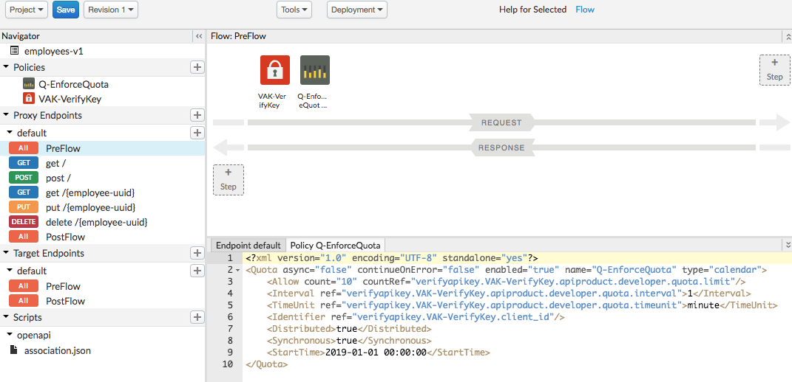
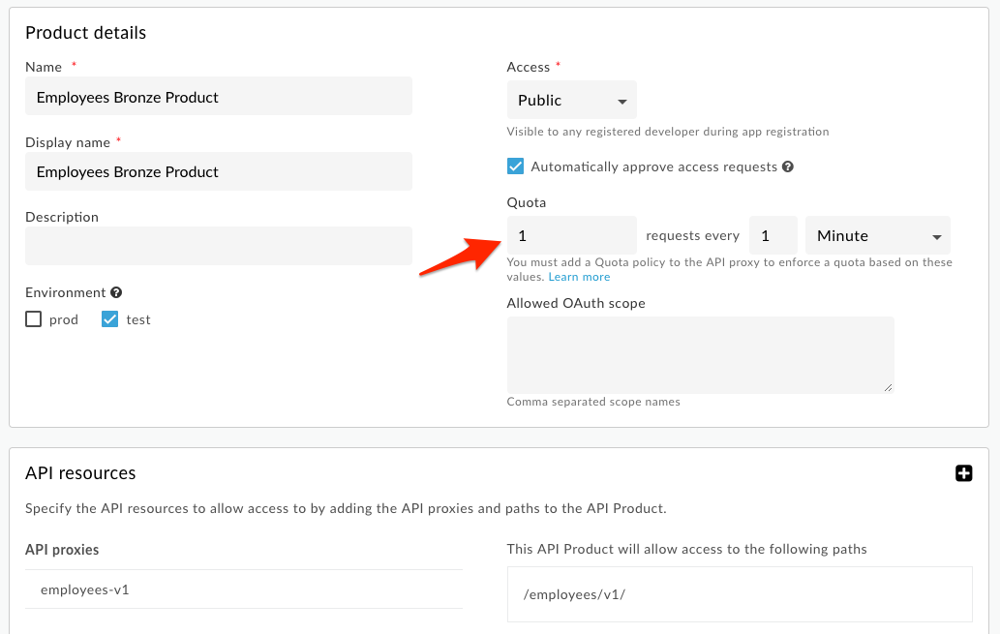
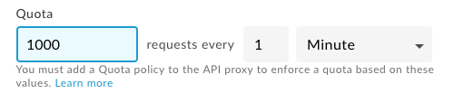
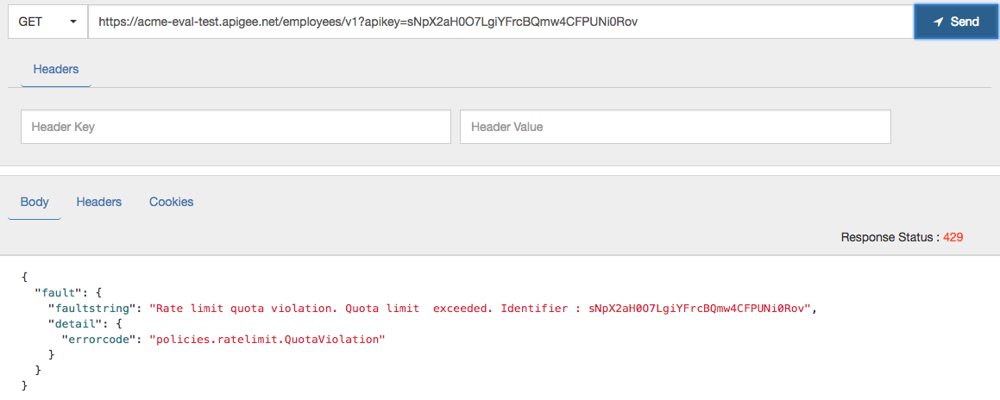

# Traffic Management : Rate Limit APIs

*Duration : 15 mins*

*Persona : API Team / API Product Manager*

# Use case

You have a requirement to apply rate limits (quota limits) dynamically, such that you can package your APIs into different bundles each with their own quotas applied. For example, you want to be able to provide ‘Platinum’ level access that has a very high quota, and ‘Bronze’ level access that has a very low quota, both for the same underlying APIs.  
レート制限(クォータ制限)を動的に適用する必要があり、API をそれぞれのクォータが適用された異なるバンドルにパッケージ化することができます。例えば、非常に高いクォータを持つ 'Platinum' レベルのアクセスと、非常に低いクォータを持つ 'Bronze' レベルのアクセスを、同じ基礎となる API に対して提供できるようにしたいとします。

# How can Apigee Edge help?

Apigee provides the capability to apply quotas to API proxies to limit access to them as required.  
ApigeeはAPIプロキシにクォータを適用し、必要に応じてアクセスを制限する機能を提供する。

Apigee also provides the capability to apply API quota settings at the ‘API Product’ level, allowing you to define multiple products for the same APIs, each with their own quota settings.  
ApigeeはAPIクォータ設定を'API Product'レベルで適用する機能も提供しており、同じAPIに対して複数のプロダクトを定義し、それぞれにクォータ設定を行うことができます。

# Pre-requisites  前提条件

You must have completed labs 1 - 4 in order to run this lab.  
このlabを実践するためには、研究室1～4を修了している必要があります。

# Instructions

Note: As you will have already completed labs 1 - 4 and are familiar with how to setup API products and developer apps, as well as how to use a REST client to specify an API key, detailed instructions for those steps will be omitted here. Refer back to the previous labs if you need to see detailed instructions for those steps.  
注: ラボ 1～4 を終了し、API 製品や開発者アプリのセットアップ方法や REST クライアントを使用して API キーを指定する方法を熟知していると思いますので、ここではそれらの手順の詳細な説明は省略させていただきます。これらの手順の詳細な説明が必要な場合は、前回のラボを参照してください。

* Login to the Edge Management UI.  
Edge Management UIにログインします。

* Open up the **Develop** tab of your Employees API that you've used in the previous labs.  
前のラボで使用した、Employees APIの**Develop**タブを開きます。

* In the proxy request pre-flow add a **Quota policy** directly after the *Verify API Key Policy* with the following configuration (note that in the below configuration 'VAK-VerifyKey' refers to the name of the Verify API Key policy that you had added. If you used a different name you will need to alter this in the configuration):  
プロキシリクエストのプリフローで、*Verify API Key Policy*の直後に**Quota policy**を以下の設定で追加します（以下の設定では、「VAK-VerifyKey」は、追加したVerify API Key Policyの名前を指していることに注意してください）。別の名前を使用した場合は、構成でこれを変更する必要があります。)

```
<?xml version="1.0" encoding="UTF-8" standalone="yes"?>
<Quota async="false" continueOnError="false" enabled="true" name="Q-EnforceQuota" type="calendar">
    <Allow count="10" countRef="verifyapikey.VAK-VerifyKey.apiproduct.developer.quota.limit"/>
    <Interval ref="verifyapikey.VAK-VerifyKey.apiproduct.developer.quota.interval">1</Interval>
    <TimeUnit ref="verifyapikey.VAK-VerifyKey.apiproduct.developer.quota.timeunit">minute</TimeUnit>
    <Identifier ref="verifyapikey.VAK-VerifyKey.client_id"/>
    <Distributed>true</Distributed>
    <Synchronous>true</Synchronous>
    <StartTime>2019-01-01 00:00:00</StartTime>
</Quota>
```

* Your API proxy should now look like this:



* Be sure to save your proxy changes.  
プロキシの変更は必ず保存しておいてください。

* Create 2 new API products that include this proxy, ‘**Employees Bronze Product**’ and ‘**Employees Platinum Product**’ (refer back to [Lab-3](../Lab%203%20API%20Publishing%20-%20API%20Products%20and%20Developer%20Portals) if you don't remember how to create an API product).  
このプロキシを含む2つの新しいAPIプロダクト、「**Employees Bronze Product**」と「**Employees Platinum Product**」を作成します（APIプロダクトの作成方法がわからない場合は、[Lab-3](.../Lab%203%20API%20Publishing%20-%20API%20Products%20and%20Developer%20Portals)を参照してください）。

For both products specify as before:  
両 product ともに、これまでと同様に指定してください。

  * Environment: test

  * Access: Public

  * Automatically approve access requests.

  * Add your API proxy to the product.

For the **Bronze** product specify a quota limit of 1 request per minute:  
e **Bronze** productでは、1分間に1リクエストのクォータ制限を指定してください。



For the **Platinum** product specify a quota limit of 1000 requests per minute:  
 **Platinum** productでは、1分間に1000リクエストのクォータ制限を指定してください。

	

* Using the developer portal, register 2 new developer apps, one for each of your new products (refer back to [Lab-4](../Lab%204%20API%20Consumption%20-%20Developers%20and%20Apps) if you don't remember how to register a developer app). Record the API keys for each app.  
開発者ポータルを使用して、新しい開発者アプリを2つ、それぞれ1つずつ登録します(開発者アプリの登録方法を覚えていない場合は、[Lab-4](.../Lab%204%20API%20Consumption%20-%20Developers%20and%20Apps)を参照してください)。各アプリのAPIキーを記録します。

* Launch the [REST Test client](https://apigee-restclient.appspot.com/) and run some tests using each API key. Verify that the *Bronze* API key cannot be used to send in more than 1 request per minute without triggering a quota exceeded exception:  
REST Test client](https://apigee-restclient.appspot.com/)を起動し、各APIキーを使用していくつかのテストを実行します。Bronze* API キーを使用して、クォータ超過例外を発生させずに 1 分間に 1 つ以上のリクエストを送信できないことを確認してください。



* Verify with the *Platinum* key that you can send in more than 1 request per minute.	
1分に1回以上のリクエストを送信できる *Platinum* キーで検証します。	

# Lab Video

If you like to learn by watching, here is a short video on setting up dynamic quotas [https://youtu.be/f9jg1fJJTRE](https://youtu.be/f9jg1fJJTRE).  
見て学ぶのが好きな方は、ダイナミッククォータの設定についての短い動画をご紹介します[https://youtu.be/f9jg1fJJTRE](https://youtu.be/f9jg1fJJTRE)。

# Earn Extra-points

* Start a trace session for your API proxy and use it to determine at what point the quota values specified in the API product are made available within the API proxy.  
APIプロキシのトレースセッションを開始し、API製品で指定されたクォータ値がAPIプロキシ内で利用可能になった時点を判断するために使用します。

# Quiz

1. In the quota configuration we provided, the ‘distributed’ and ‘synchronous’ attributes were both set to ‘true’. What is the implication for each of these if we set them to ‘false’?  
提供したクォータ設定では、'distributed'と'synchronous'属性は両方とも'true'に設定されていました。これらを'false'に設定した場合、それぞれにはどのような意味があるのでしょうか?

2. How would you configure the quota so that POST calls are counted as 2 calls for the purposes of evaluating the quota?  
クォータを評価するために、POSTコールを2コールとしてカウントするように クォータを設定するにはどうすればよいでしょうか?

# Summary

That completes this hands-on lesson. In this simple lab you learned how to apply a quota to an API proxy and use API product configuration to dynamically alter the quota within different contexts.  
以上でこのハンズオンレッスンは終了です。このシンプルなラボでは、API プロキシにクォータを適用し、API 製品の設定を使用して異なるコンテキスト内でクォータを動的に変更する方法を学びました。

# References

* Useful Apigee documentation links on quotas: 

    * Quota Policy Reference: [https://docs.apigee.com/api-platform/reference/policies/quota-policy](https://docs.apigee.com/api-platform/reference/policies/quota-policy)

    * Community post on setting up dynamic quotas: [https://community.apigee.com/questions/1488/how-do-the-quota-settings-on-an-api-product-intera.html](https://community.apigee.com/questions/1488/how-do-the-quota-settings-on-an-api-product-intera.html) 

* Watch this 4minute video on "Dynamic Quotas’ - [https://youtu.be/z8Rj_VzSbh4](https://youtu.be/z8Rj_VzSbh4) 

# Rate this lab

How did you like this lab? Rate [here](https://goo.gl/forms/BJGUY07XCGboHxrw2).


