# Security : Threat Protection

*Duration : 15 mins*

*Persona : API Team / Security*

# Use case

You have an existing Apigee API proxy that takes requests from the Internet and forwards them to an existing service. You have a requirement to ensure the integrity of the API message content, by protecting against threats such as JSON/XML/SQL injection and other malicious payload manipulation.  
インターネットからリクエストを受け取り、既存のサービスに転送する既存のApigee APIプロキシをお持ちです。JSON/XML/SQLインジェクションやその他の悪意のあるペイロード操作などの脅威から保護することで、APIメッセージの内容の完全性を確保する必要があります。

# How can Apigee Edge help?  
Apigee Edgeはどのように役立ちますか？

Message content is a significant attack vector used by malicious API consumers. Apigee Edge provides a set of out-of-the-box policies that help mitigate the potential for your backend services to be compromised by attackers or by malformed request payloads.  
メッセージコンテンツは、悪意のあるAPI利用者が利用する重要な攻撃ベクトルです。Apigee Edge は、攻撃者や不正なリクエストペイロードによってバックエンドサービスが危険にさらされる可能性を軽減するための、既成のポリシーを提供します。

In this lab we will see how to use the following policies:  
このラボでは、以下のポリシーの使用方法について説明します。
 - JSON Threat Protection policy        (JSON 脅威防御ポリシー)
 - Regular Expression Protection policy (正規表現保護方針)

# Pre-requisites  前提条件

* Basic understanding of [JSON](https://www.json.org/) and [XML](https://www.w3.org/TR/2008/REC-xml-20081126) data formats.  
[JSON](https://www.json.org/)と[XML](https://www.w3.org/TR/2008/REC-xml-20081126)のデータ形式の基本的な理解。
* Basic understanding of [SQL injections](https://en.wikipedia.org/wiki/SQL_injection)  
 [SQL インジェクション](https://en.wikipedia.org/wiki/SQL_injection)の基本的な理解
* Basic understanding of [Regular Expressions](https://developer.mozilla.org/en-US/docs/Web/JavaScript/Guide/Regular_Expressions)  
[正規表現](https://developer.mozilla.org/en-US/docs/Web/JavaScript/Guide/Regular_Expressions)の基本的な理解
* Completed a previous [Virtual API Jam](https://github.com/rmistry75/devjam3/tree/master/Labs/VirtualAPIJam) or have the equivalent knowledge of API lifecycle management, and specifically, API proxy policy configuration and enforcement on Apigee Edge. Alternatively, go through the ["Getting started guide"](https://docs.apigee.com/api-platform/get-started/get-started) in the Apigee Docs site.  
過去の[Virtual API Jam](https://github.com/rmistry75/devjam3/tree/master/Labs/VirtualAPIJam)を修了しているか、APIライフサイクル管理、特にApigee Edge上でのAPIプロキシポリシーの設定と実施に関する同等の知識を持っていること。またはApigee Docsサイトの["Getting started guide"](https://docs.apigee.com/api-platform/get-started/get-started)を参照してください。
* Completed [Lab 1 - Traffic Management](https://github.com/aliceinapiland/AdvancedVirtualAPIJam/tree/master/SecurityJam/Lab%201%20Traffic%20Management%20-%20Throttle%20APIs), of this Virtual API Jam - Security  
このVirtual API Jam - Securityの[Lab 1 - Traffic Management](https://github.com/aliceinapiland/AdvancedVirtualAPIJam/tree/master/SecurityJam/Lab%201%20Traffic%20Management%20-%20Throttle%20APIs)を終了している。

# Instructions

## JSON Threat Protection  
JSON 脅威からの保護

1. In your org, select **Develop → API Proxies** in the side navigation menu, and select the API proxy previously created in Lab 1.  
自分の組織で、サイドナビゲーションメニューから **Develop → API Proxies** を選択し、ラボ1で以前に作成したAPIプロキシを選択します

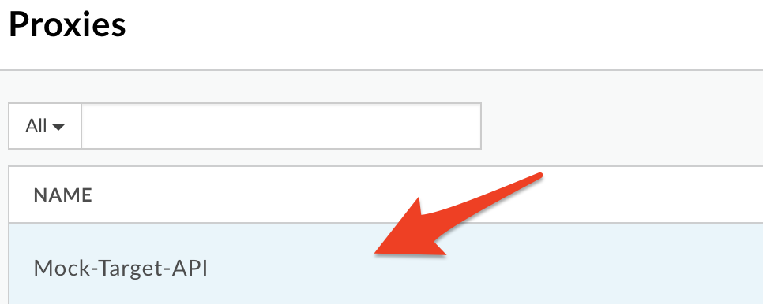

2. Click on the **Develop** tab to access the API Proxy development dashboard.

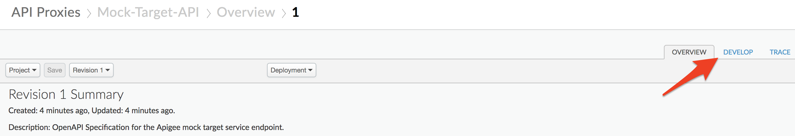

3. Click on the "**Send request and view request headers and body**" flow under Proxy Endpoints default, and then click on **+Step** on the upper right of the Request flow to attach a JSON Threat Protection policy.  
Proxy Endpointsのデフォルトの「**Send request and view request headers and body**」フローをクリックし、Requestフローの右上にある**+Step**をクリックして、JSON Threat Protectionポリシーを添付します。

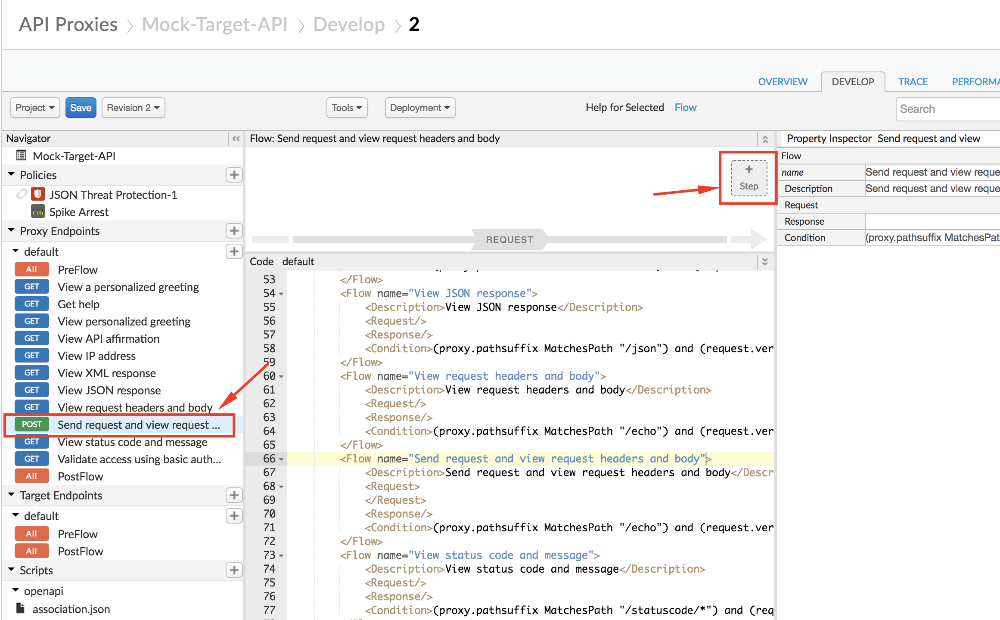

4. Select **JSON Threat Protection** policy. Click on **Add** button to add the policy to the selected flow's request pipeline.  
JSON Threat Protection**ポリシーを選択します。Add**ボタンをクリックして、選択したフローのリクエストパイプラインにポリシーを追加します。

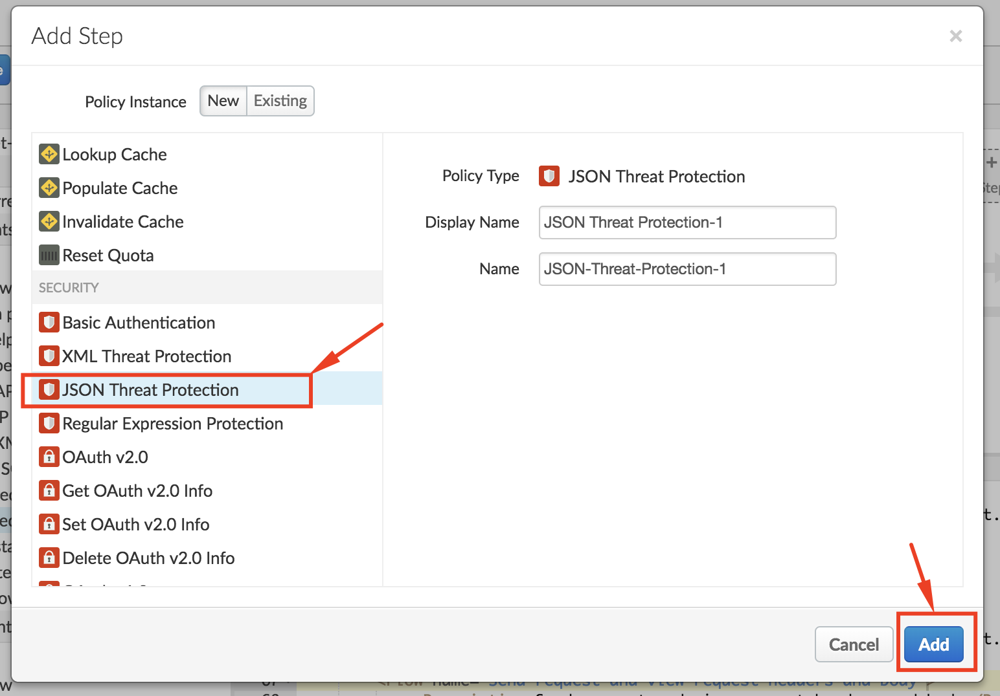

5. Select the policy to display the policy's XML configuration in the editor.  
ポリシーを選択して、エディタでポリシーの XML 構成を表示します。

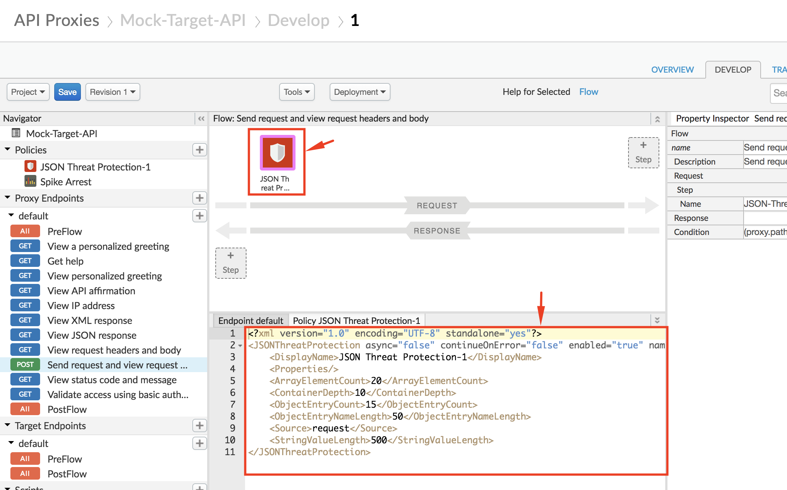

6. Change the policy's XML configuration to the below snippet to enforce protection against JSON payload manipulation threats.  
ポリシーの XML 構成を以下のスニペットに変更して、JSON ペイロード操作の脅威からの保護を強化します。

```
<?xml version="1.0" encoding="UTF-8" standalone="yes"?>
<JSONThreatProtection async="false" continueOnError="false" enabled="true" name="JSON-Threat-Protection-1">
    <DisplayName>JSON Threat Protection-1</DisplayName>
    <Properties/>
    <ObjectEntryCount>5</ObjectEntryCount>
    <Source>request</Source>
</JSONThreatProtection>
```

In the above example, we use the JSON Threat Protection policy to ensure that the incoming API request JSON payload does not contain more than 5 fields. If the incoming payload contains more than 5 fields, the API proxy returns an error response.
For a full list of JSON integrity checks that can be performed using this policy, see the [JSON Threat Protection policy documentation](https://docs.apigee.com/api-platform/reference/policies/json-threat-protection-policy#elementreference).  
上記の例では、JSON Threat Protectionポリシーを使用して、受信APIリクエストJSONペイロードに5つ以上のフィールドが含まれないようにしています。受信ペイロードに 5 つ以上のフィールドが含まれている場合、API プロキシはエラー応答を返します。
このポリシーを使用して実行できるJSON完全性チェックの完全なリストについては、[JSON Threat Protectionポリシーのドキュメント](https://docs.apigee.com/api-platform/reference/policies/json-threat-protection-policy#elementreference)を参照してください。

7. Click on **Save** to save the API Proxy changes.  
APIプロキシの変更を保存するには、**Save**をクリックします。

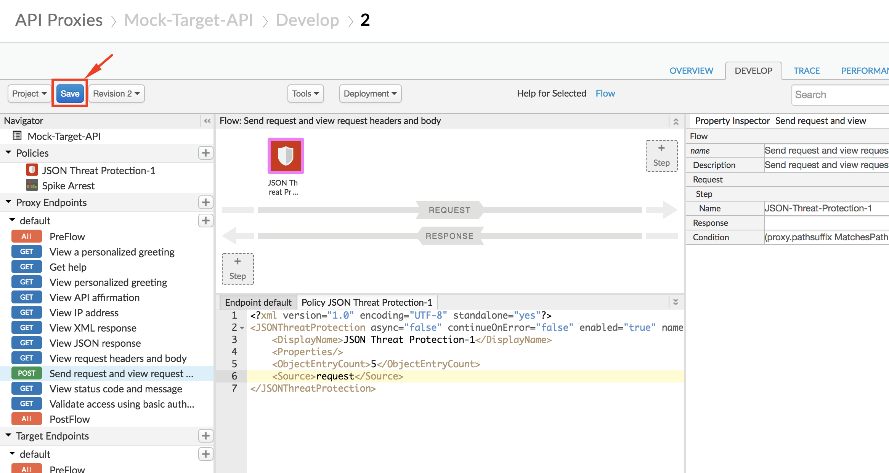

### To Test JSON Threat Protection:

1. To test the changes made, first click on **Trace** tab of the API proxy dashboard, and click on **Start Trace Session** button.  
変更した内容をテストするには、まずAPIプロキシダッシュボードの**Trace**タブをクリックし、**Start Trace Session**ボタンをクリックします。

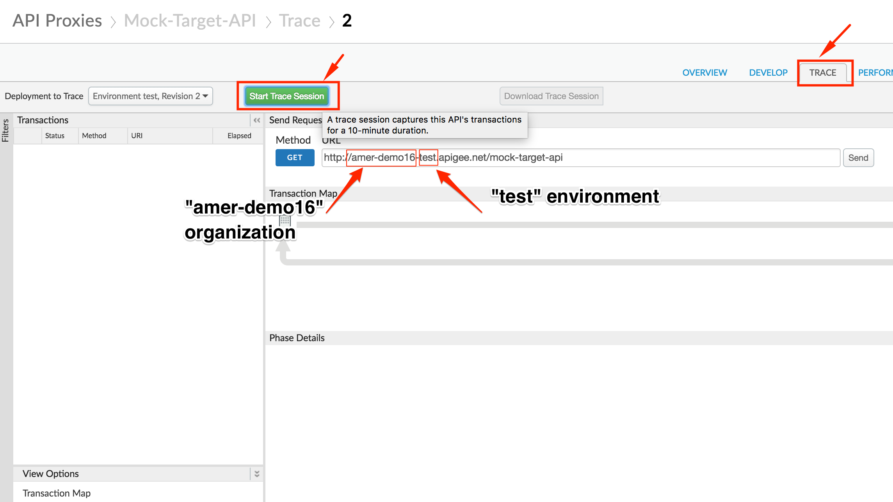

* **Note**: Take note of the Apigee `organization` and `environment` you are working in. In the screenshot above, the organization is `amer-demo16` and the environment is `test`. Your organization name will likely end in `*-eval`  
**注**. あなたが作業している Apigee の `organization` と `environment` に注意してください。上のスクリーンショットでは、組織は `amer-demo16` で、環境は `test` です。組織名はおそらく `*-eval` で終わるでしょう。

2. Now, send a POST request to your API endpoint at **http://{{your-organization}}-{{your-environment}}.apigee.net/mock-target-api/echo** with the following format:  
APIエンドポイントにPOSTリクエストを送信します。**http://{{your-organization}}}-{{your-environment}}.apigee.net/mock-target-api/echo**に以下のフォーマットで送信します。
```
POST /mock-target-api/echo HTTP/1.1
Host: {{your org}}-{{your env}}.apigee.net
Content-Type: application/json

{
"field1": "test_value1",
"field2": "test_value2",
"field3": "test_value3",
"field4": "test_value4",
"field5": "test_value5",
"field6": "test_value6"
}
```

You can make this call either using a REST client like the one [here](https://apigee-rest-client.appspot.com/), or using a terminal command such as **curl**.  
この呼び出しは、[ここ](https://apigee-rest-client.appspot.com/) のような REST クライアントを使用するか、**curl** のようなターミナルコマンドを使用して行うことができます。
```
curl -X POST "http://{{your-org}}-{{your-env}}.apigee.net/mock-target-api/echo" -H "Content-Type: application/json" -d '{"field1": "test_value1", "field2": "test_value2", "field3": "test_value3", "field4": "test_value4", "field5": "test_value5", "field6": "test_value6"}'
```
* **Note:** If you are using a REST client, make sure that your HTTP request has a Header name/value pair of `Content-Type: application/json` as shown below  
 **注:**RESTクライアントを使用している場合は、HTTPリクエストのヘッダ名と値のペアが以下のように `Content-Type: application/json` であることを確認してください。

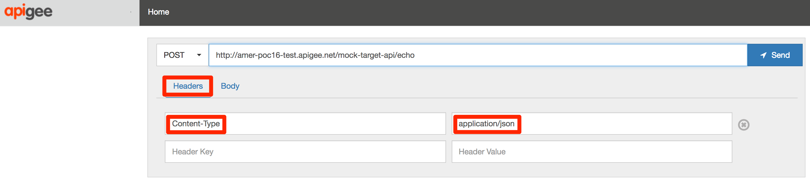

3. The response received will be an error, since we attempted to send more than 5 fields in the POST request payload.  
POSTリクエストのペイロードに5つ以上のフィールドを送信しようとしたため、受信したレスポンスはエラーとなります。

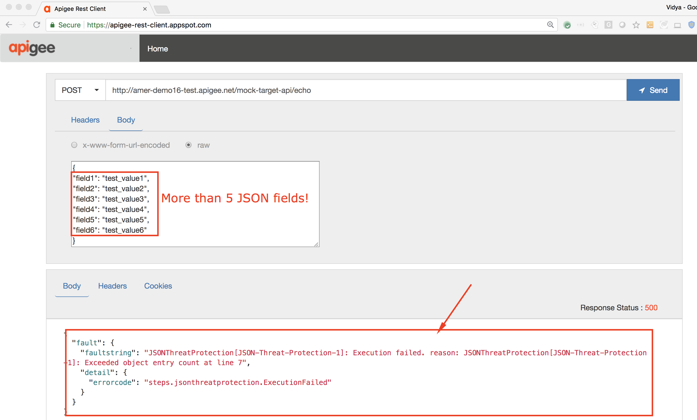

We also see that the JSON Threat Protection policy was triggered to return this error response, when we see the Trace screen.  
また、トレース画面を見ると、このエラー応答を返すために JSON Threat Protection ポリシーがトリガーされていることがわかります。

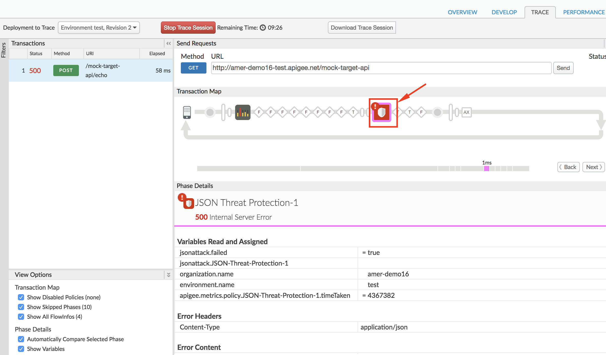

4. You can now test for a successful API call, by sending the API endpoint a similar POST request, but this time with 5 or fewer fields in the JSON payload.  
API エンドポイントに同様の POST リクエストを送信することで、API 呼び出しが成功したかどうかをテストできますが、今回は JSON ペイロードに 5 つ以下のフィールドが含まれています。
```
POST /mock-target-api/echo HTTP/1.1
Host: {{your-org}}-{{your-env}}.apigee.net
Content-Type: application/json

{
"field1": "test_value1",
"field2": "test_value2",
"field3": "test_value3",
"field4": "test_value4",
"field5": "test_value5"
}
```

You can make this call either using a REST client like the one [here](https://apigee-rest-client.appspot.com/), or using a terminal command such as **curl**.  
この呼び出しは、[ここ](https://apigee-rest-client.appspot.com/) のような REST クライアントを使用するか、**curl** のようなターミナルコマンドを使用して行うことができます。
```
curl -X POST "http://{{your-org}}-{{your-env}}.apigee.net/mock-target-api/echo" -H "Content-Type: application/json" -d '{"field1": "test_value1", "field2": "test_value2", "field3": "test_value3", "field4": "test_value4", "field5": "test_value5"}'
```

3. The response received will be a successful one, since we attempted to send fewer fields in the POST request payload.  
POSTリクエストのペイロードでより少ないフィールドを送信しようとしたため、受信したレスポンスは成功したものになります。

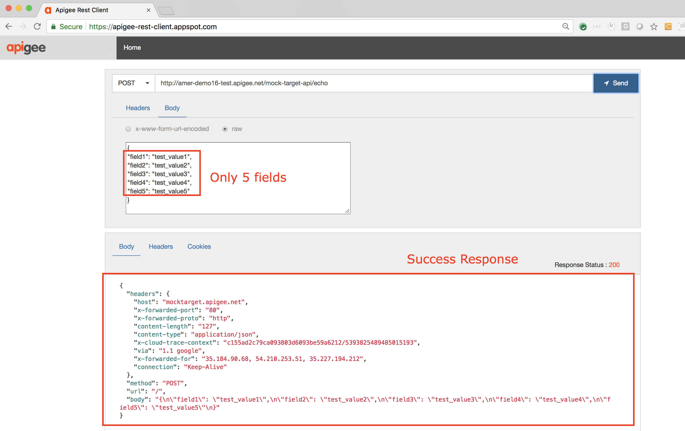

We also see that the JSON Threat Protection policy allowed the request to go through and hit the API target, when we see the Trace screen.  
また、トレース画面を見ると、JSON Threat Protectionポリシーによってリクエストが通過し、APIターゲットにヒットしたことがわかります。

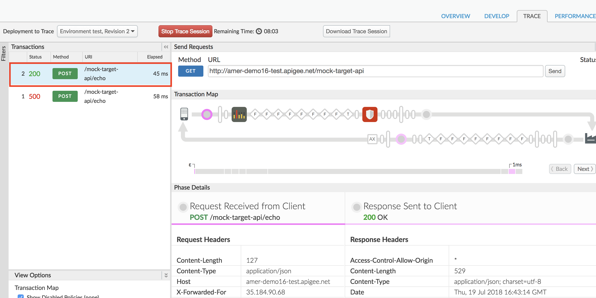

## Regular Expression Protection(正規表現の保護)

### Add Protection Against SQL Injections(SQL インジェクションに対する保護機能の追加)

1. Click on the "**View IP address**" flow under Proxy Endpoints default. Click on **+Step** on the upper right of the Request flow and attach a Regular Expression Protection policy.  
 Proxy Endpointsのデフォルトの下にある「**View IP address**」フローをクリックします。リクエストフローの右上にある「**+Step**」をクリックし、正規表現保護ポリシーを添付します。

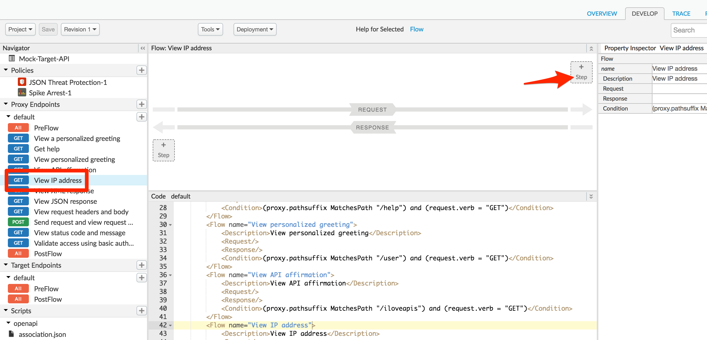

2. Select **Regular Expression Protection** policy. Click on **Add** button to add the policy to the selected flow's request pipeline.  
正規表現保護**ポリシーを選択します。追加**ボタンをクリックして、選択したフローのリクエストパイプラインにポリシーを追加します。

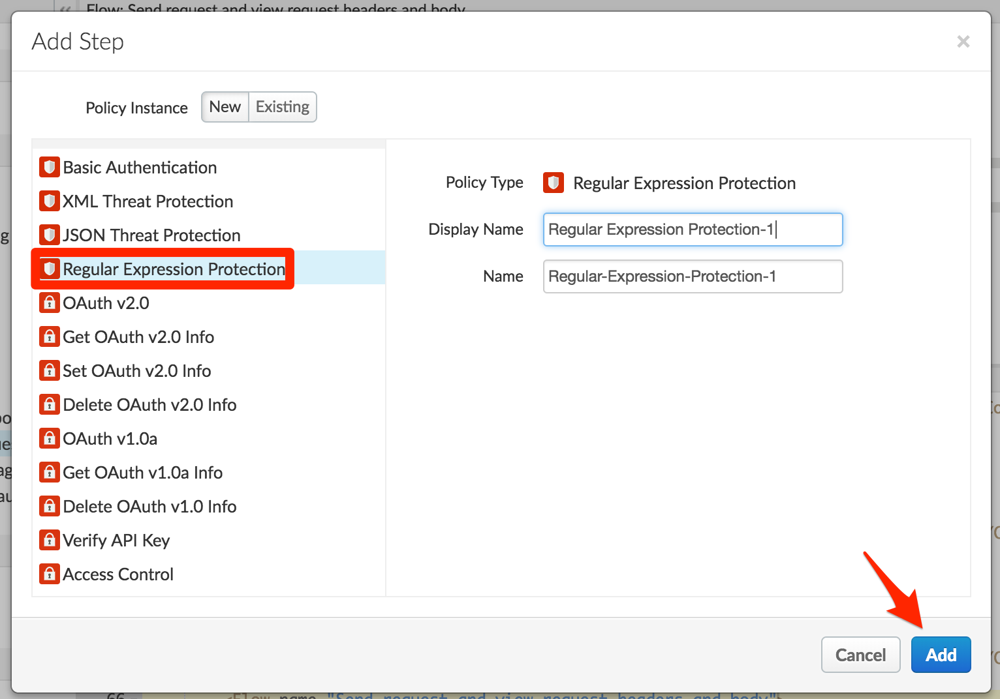

3. Select the policy to display the policy's XML configuration in the editor.  
ポリシーを選択して、エディタでポリシーの XML 構成を表示します。

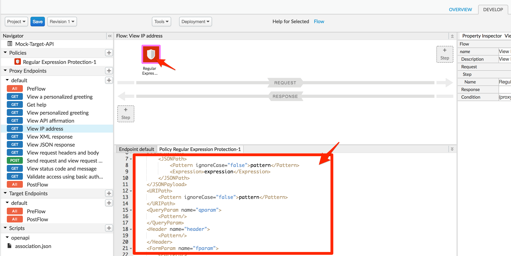

4. Change the policy's XML configuration to the below snippet to protect against SQL injections.  
ポリシーの XML 構成を以下のスニペットに変更して、SQL インジェクションから保護します。
```
<?xml version="1.0" encoding="UTF-8" standalone="yes"?>
<RegularExpressionProtection async="false" continueOnError="false" enabled="true" name="Regular-Expression-Protection-1">
    <Source>request</Source>
    <QueryParam name="query">
        <Pattern>[\s]*(?i)((delete)|(exec)|(drop\s*table)|(insert)|(shutdown)|(update)|(\bor\b))</Pattern>
    </QueryParam>
</RegularExpressionProtection>
```

In the above example, the Regular Expression Protection policy has been configured with a pattern that matches common SQL injection attacks. This pattern will be checked against the value of the query parameter named `query`, and if there is a match, the policy will return an error response. Note that the policy lets you check the pattern against all types of input parameters and body content.  
上記の例では、正規表現保護ポリシーは一般的なSQLインジェクション攻撃にマッチするパターンで構成されています。このパターンは `query` という名前のクエリパラメータの値に対してチェックされ、一致する場合、ポリシーはエラー応答を返します。このポリシーでは、すべてのタイプの入力パラメータと本文の内容に対してパターンをチェックすることができることに注意してください。

For other sample patterns, reference the [Regular Expression Protection policy documentation](https://docs.apigee.com/api-platform/reference/policies/regular-expression-protection#abouttheregularexpressionprotectionpolicy-exampleblacklistpatterns).  
その他のサンプルパターンについては、[正規表現保護ポリシーのドキュメント](https://docs.apigee.com/api-platform/reference/policies/regular-expression-protection#abouttheregularexpressionprotectionpolicy-exampleblacklistpatterns)を参照してください。

5. Click on **Save** to save the API Proxy changes.  
**Save** をクリックして、API プロキシの変更を保存します。

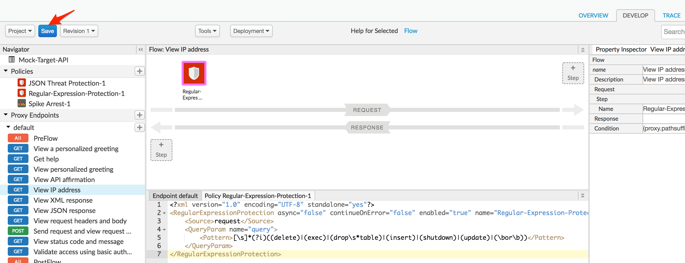

### Test Regular Expression Protection:  
正規表現の保護をテストします。

1. To test the changes made, first click on **Trace** tab of the API proxy dashboard, and click on **Start Trace Session** button.  
APIプロキシダッシュボードの**Trace**タブをクリックし、**Start Trace Session**ボタンをクリックします。

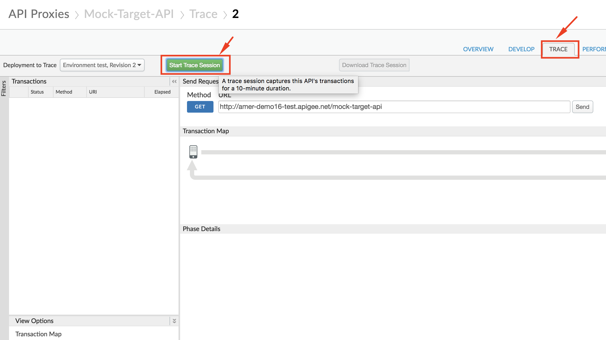

2. Now, send a GET request to your API endpoint at **http://{{your-organization}}-{{your-environment}}.apigee.net/mock-target-api/ip?query=** with any of the following entries in the `query` parameter. Try out all of the entries, and see if you can determine what each attack is trying to do!  
次に、APIエンドポイント**http://{{your-organization}}-{{your-environment}}}.apigee.net/mock-target-api/ip?query=** に、`query`パラメータに以下のいずれかのエントリを指定して、APIエンドポイントにGETリクエストを送信します。すべてのエントリを試してみて、それぞれの攻撃が何をしようとしているかを判断できるかどうか見てみましょう!
```
query=delete
query=password’ OR 1=1
query=5; DROP TABLE USERS;
```

You can make this call either using a REST client like the one [here](https://apigee-rest-client.appspot.com/), or using a terminal command such as **curl**.  
この呼び出しは、[ここ](https://apigee-rest-client.appspot.com/) のような REST クライアントを使用するか、**curl** のようなターミナルコマンドを使用して行うことができます。
```
curl "http://{{your-org}}-{{your-env}}.apigee.net/mock-target-api/ip?query={{insert SQL injection attack here}}"
```

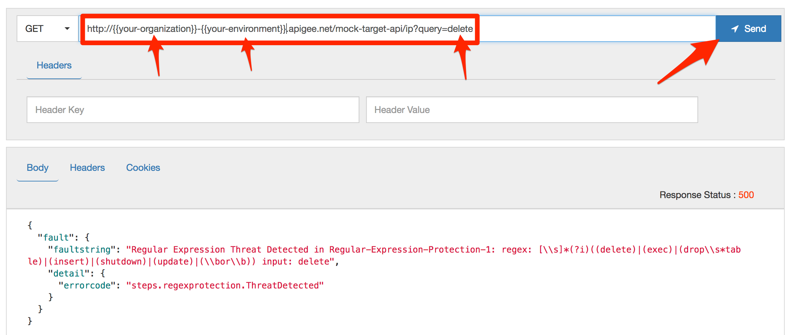

3. The response received will be an error, since we attempted to send a malicious attack that we have configured our policy to recognize.  
 ポリシーで認識できるように設定した悪意のある攻撃を送信しようとしたため、受信したレスポンスはエラーとなります。

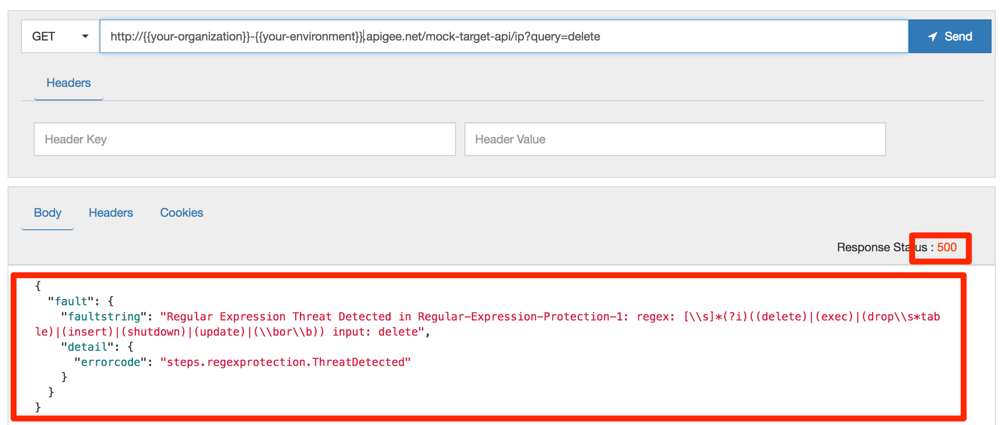

We can also confirm from the Trace screen that the Regular Expression Protection policy was triggered to return this error response.  
このエラー応答を返すために正規表現保護ポリシーが発動されたことも、トレース画面から確認できます。

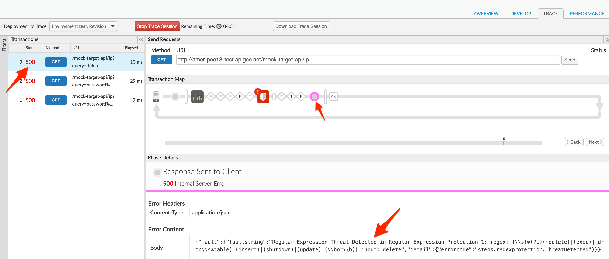

# Lab Video

If you like to learn by watching, here are short 4 minute videos on using:
- [JSON Threat Protection Policy](https://youtu.be/LIUeaAvRuTQ)
- [RegEx Protection Policy](https://youtu.be/NLg_LE3u-vM)

# Earn Extra-points

Now that you have tried the JSON and Regular Expression Threat Protection policies, try out the [XML Threat Protection policy](https://docs.apigee.com/api-platform/reference/policies/xml-threat-protection-policy) that helps you check the API payload content integrity in the case of XML payloads.  
JSON と正規表現の脅威防御ポリシーを試したところで、XML ペイロードの場合に API ペイロードのコンテンツの整合性をチェックするのに役立つ [XML 脅威防御ポリシー](https://docs.apigee.com/api-platform/reference/policies/xml-threat-protection-policy) を試してみてください。

# Summary

That completes this hands-on lesson. In this simple lab you learned how to protect your API payloads against payload content based threats.  
以上で、この実践的なレッスンは終了です。このシンプルなラボでは、ペイロードのコンテンツに基づく脅威から API ペイロードを保護する方法を学びました。

# References

* Useful Apigee documentation links on Threat Protection policies  -

    * [JSON Threat Protection Policy](https://docs.apigee.com/api-platform/reference/policies/json-threat-protection-policy)

    * [XML Threat Protection Policy](https://docs.apigee.com/api-platform/reference/policies/xml-threat-protection-policy)

    * [Regular Expression Protection policy](https://docs.apigee.com/api-platform/reference/policies/regular-expression-protection)

    * [Video](https://youtu.be/rC8kZJgwBFM) on using Threat Protection policies in Apigee Edges

Now go to [Lab-3](https://github.com/aliceinapiland/AdvancedVirtualAPIJam/tree/master/SecurityJam/Lab%203%20-%20Securing%20APIs%20with%20OAuth2%20Client%20Credentials)
