# **API Security : JWT**

*Duration : 15 mins*

*Persona : API Team/Security*

# **Use case**

You have an API that is consumed by third parties. You want to secure that API using JWT.  
サードパーティに消費されるAPIがあるとします。そのAPIをJWTで保護したいとします。

# **How can Apigee Edge help?**  
**Apigee Edgeはどのように役立ちますか？

[https://docs.apigee.com/api-platform/reference/policies/jwt-policies-overview](https://docs.apigee.com/api-platform/reference/policies/jwt-policies-overview)

# **Pre-requisites**

* You have completed [Lab 1](https://github.com/aliceinapiland/AdvancedVirtualAPIJam/tree/master/SecurityJam/Lab%201%20Traffic%20Management%20-%20Throttle%20APIs). If not, please complete that first.

# **Instructions**

* Go to [https://apigee.com/edge](https://apigee.com/edge) and log in. This is the Edge management UI.

* Select Admin → Environments in the side menu

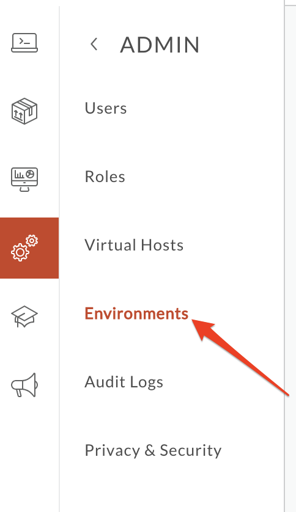

* Select Key Value Maps tab, change Environment Configuration to "test’, and click **+Key Value Map**:

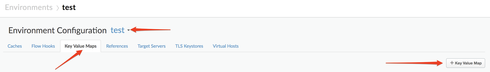

* Type "jwt-secret-key" (must be this name exactly) in the text box and click **Add**:

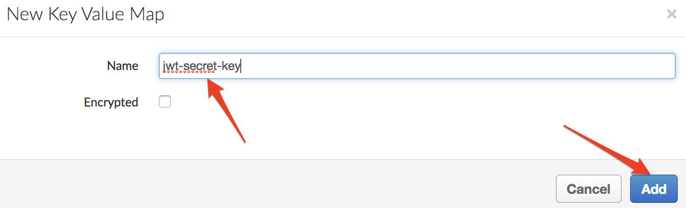

* Now that the key value map is created, add a Shared Secret (key: secret, value: Apigee123 or your choice) to it as shown:  
これでキーバリューマップが作成されたので、図のように共有シークレット(key: secret, value: Apigee123 または任意のもの)を追加します。

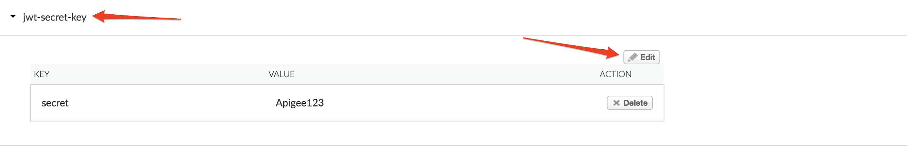

* This shared secret will be used to both generate and verify JWT tokens using the HS256 algorithm.  
この共有秘密は、HS256 アルゴリズムを使用して JWT トークンの生成と検証の両方に使用されます。

* Go to Develop → Api Proxies:

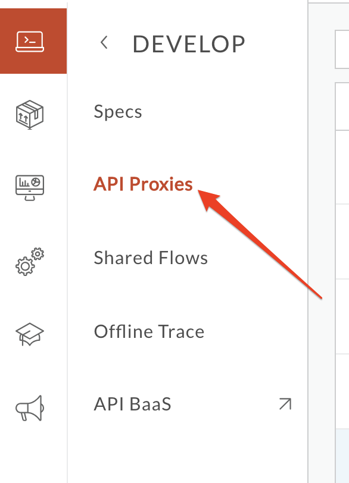

* Click the **+Proxy** button on the top-right corner to invoke the Create Proxy wizard.

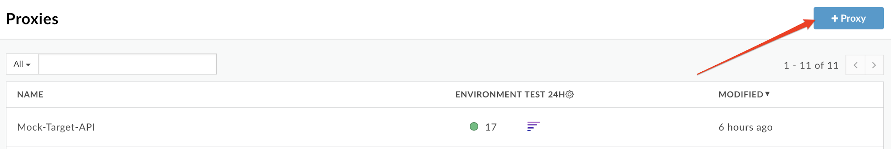

* Select **Proxy Bundle** and then click **Next** to import an existing proxy form a zip archive.

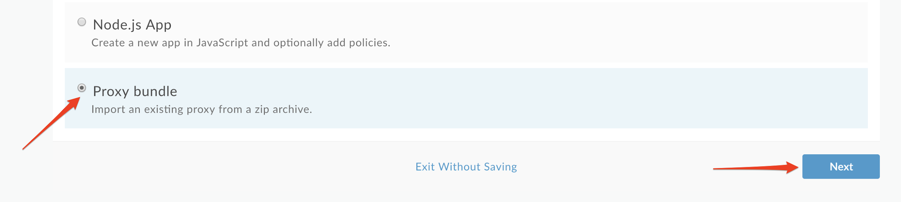

* Download the Apigee proxy "**JWT.zip**" that generates and verifies JWT’s [here](https://github.com/aliceinapiland/AdvancedVirtualAPIJam/blob/master/SecurityJam/Lab%204%20-%20JWT/JWT.zip?raw=true).  Then click "**Choose File**", select the “**JWT.zip**” file you just downloaded and click **Next**:  
* JWTの生成と検証を行うApigeeプロキシ "**JWT.zip**"をダウンロードしてください。 次に、"**Choose File**"をクリックし、ダウンロードした "**JWT.zip**"ファイルを選択し、"**Next**"をクリックしてください。

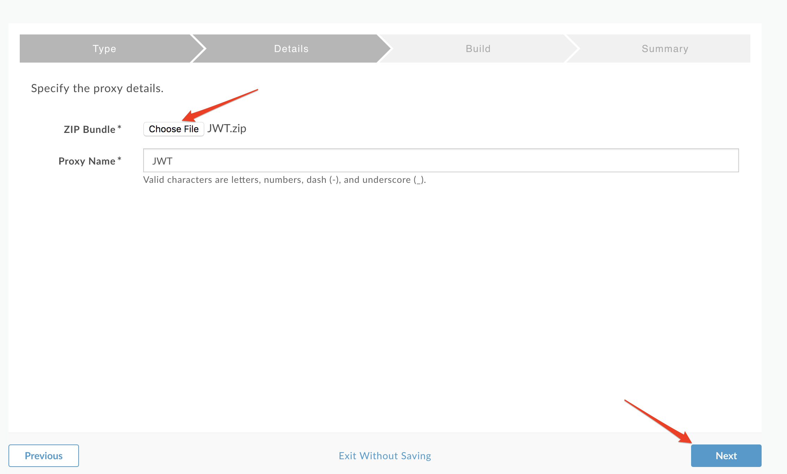

* Click **Build**.

* You should see a successful "Uploaded proxy" message..  Click on the link to the JWT proxy near the bottom of the page.

* Deploy the JWT proxy by clicking on the **Deployment** dropdown and selecting the **test** environment.

* Click on the **Develop** tab.

* You can see that the JWT proxy has two proxy endpoints: **Generate JWT** (/token) to generate a JWT, and **Verify JWT** (/verify) to verify a JWT.  Check both flows and read the XML policies to get a deeper understanding of how they work. (reference links available at the end of the lab)  
JWTプロキシには2つのプロキシエンドポイントがあることがわかります。JWT を生成するための **Generate JWT** (/token) と、JWT を検証するための **Verify JWT** (/verify) です。 両方のフローを確認し、XML ポリシーを読むことで、その仕組みをより深く理解することができます。(参考リンクはラボの最後にあります)

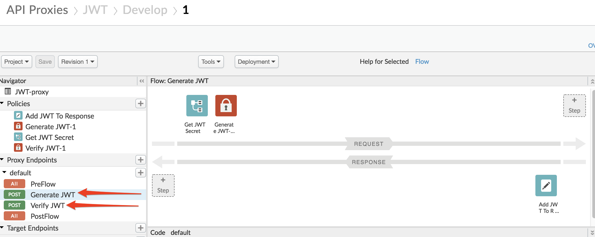

* Start by turning on **Trace** for the JWT proxy.  
JWTプロキシの**Trace**をオンにすることから始めてください。

* Then use the Apigee Rest Client: [https://apigee-rest-client.appspot.com/](https://apigee-rest-client.appspot.com/)  
その後、Apigee Rest Clientを使用してください。[https://apigee-rest-client.appspot.com/](https://apigee-rest-client.appspot.com/)

* POST to https://**{your-org-name}**-test.apigee.net/v1/jwt/token  
https://**{your-org-name}**-test.apigee.net/v1/jwt/tokenにPOSTします。

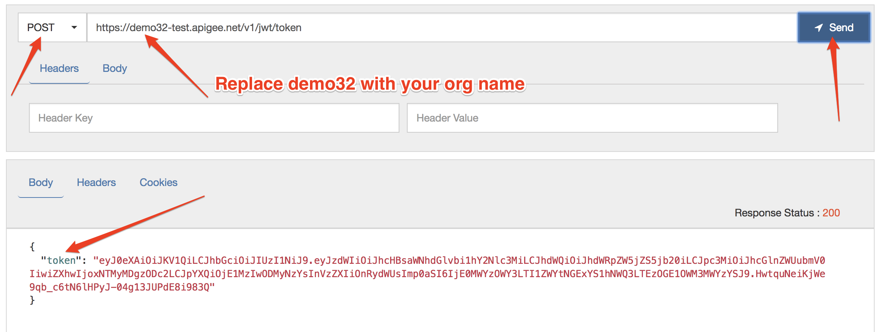

* You should see a token received in HTTP response.  Copy the token value (except for the " “) and review the Trace tool to understand what happened.  
HTTPレスポンスで受信したトークンが表示されているはずです。 トークンの値をコピーして（"を除いて）、トレースツールで確認してください。

* Go to [http://jwt.io](http://jwt.io) and paste the token in the Encoded Window (ensure the algorithm is HS256).  Also type the shared secret (e.g. **Apigee123** unless you changed it) in the Verify Signature box:  
http://jwt.io](http://jwt.io)にアクセスし、エンコードされたウィンドウにトークンを貼り付けます(アルゴリズムがHS256であることを確認してください)。 また、Verify Signature ボックスに共有秘密(例: **Apigee123**)を入力してください。

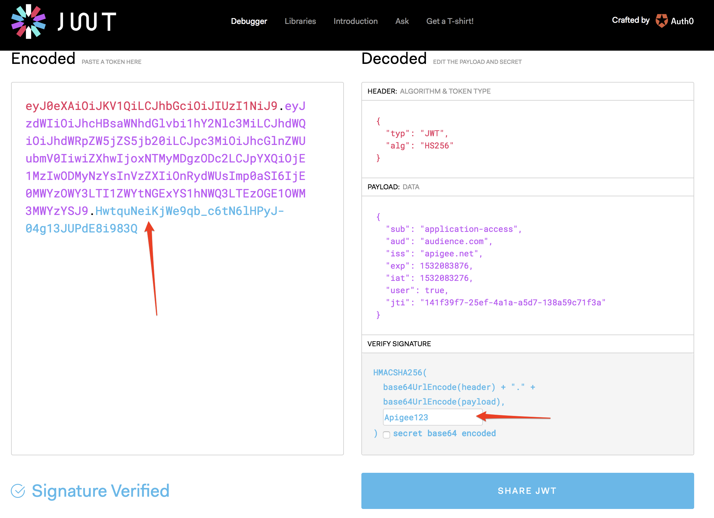

* Now verify the token.  Use the same Apigee REST tool to do so  
トークンを確認します。 同じApigee RESTツールを使用して、以下のように検証します。

* POST to https://**{your-org-name}**-test.apigee.net/v1/jwt/verify  
https://**{your-org-name}**-test.apigee.net/v1/jwt/verifyにPOSTします。

* In the Header, put "token" and its value  
ヘッダーに "token "とその値を入れてください。

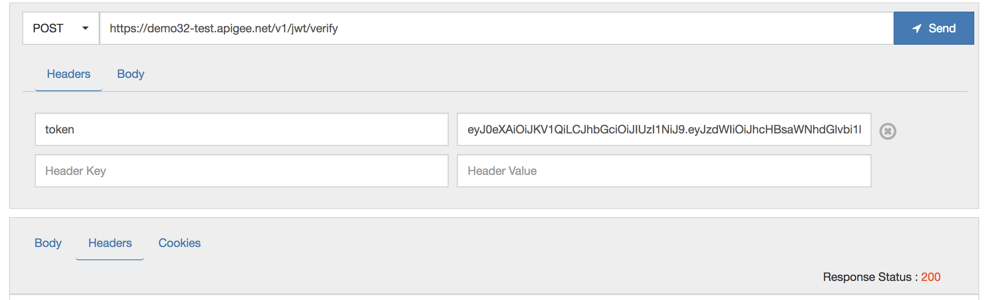

* If you get a 200 return code, the JWT is valid (as expected).  Again, review the Trace tool to understand what happened.  You can also try to tamper with the JWT (add/remove characters) and invoke the same API call again.  What happens?  
200のリターンコードを取得した場合、JWTは（予想通り）有効です。 再度、トレースツールを見直して、何が起こったのかを理解してください。   
また、JWTをいじって(文字を追加/削除して)同じAPIコールを再度呼び出してみることもできます。 どうなりますか？

# **Earn Extra-points**

Change the JWT token generation policy to include [additional claims](https://docs.apigee.com/api-platform/reference/policies/generate-jwt-policy#additionalclaimsclaim) (iss, aud, sub, extra claims) in it, to see how the behavior changes.  
JWTのトークン生成ポリシーを変更して、[additional claims](https://docs.apigee.com/api-platform/reference/policies/generate-jwt-policy#additionalclaimsclaim) (irs, aud, sub, extra claims)を含むようにして、動作の変化を確認します。

# **Summary**

* In this lab, you learned how to use Apigee's out of the box JWT policies to both generate and verify a JWT.  Now you can use these policies to actually secure an API using JWT security.  To do so, you would first want to authenticate a user against their IdP (which also contains "claims" about that user/principal) before calling GenerateJWT and issuing the JWT with claims back to that user (for simplicity, we skipped the user authentication step in this lab and hard coded the claims). The API that is protected would invoke VerifyJWT (either directly or via an Apigee endpoint) to verify the JWT and read/verify its claims.  
このラボでは、Apigee の JWT ポリシーを使用して JWT を生成し、検証する方法を学びました。 ここでは、これらのポリシーを使用して、実際に JWT セキュリティを使用して API のセキュリティを確保することができます。 そのためには、GenerateJWT を呼び出してそのユーザにクレームを含む JWT を発行する前に、まずユーザの IdP (そのユーザ/プリンシパルに関する「クレーム」も含まれています) に対してユーザを認証します (簡単のために、このラボではユーザ認証のステップを省略してクレームをハードコーディングしています)。保護されているAPIは、VerifyJWTを(直接またはApigeeエンドポイントを介して)呼び出してJWTを検証し、そのクレームを読み込んで検証します。

# **References**

* [Apigee Edge JWT token support explained in 4 minutes](https://youtu.be/mY5B6YlpkAY)

* [Apigee Edge JWT Policies Overview](https://docs.apigee.com/api-platform/reference/policies/jwt-policies-overview)

* [Adding Additional Claims to your JWT](https://docs.apigee.com/api-platform/reference/policies/generate-jwt-policy#additionalclaimsclaim)

Now go to [Lab 5](https://goo.gl/6S2iJr).
